# Manual
## Summary
 - [Introuction](#introduction)
 - [Power supply and consumption](#power-supply-and-consumption])
 - [Initial setup to allow boot from USB pendrive](#Initial-setup-to-allow-boot-from-USB-pendrive)
 - [HERMES USB installer preparation](#HERMES-USB-installer-preparation)
 - [HERMES instalation](#HERMES-installation)
 - [WiFi Setup](#wifi-setup)
 - [Radio Frequency (RF) connections assembly](#Radio-Frequency-(RF)-connections-assembly)
 - [RF test](#rf-test)
 - [E-mail setup and test](#e-mail-setuo-and-test)

## Introduction

This guide goes through the steps needed for HERMES system installation.

## Power supply and consumption

In order to connect the radio to the power source, a power cable is provided. One side of the cable comes with a XT60 connector (Figure 1) and connects to the radio, and the other end is bare wire, and should be connected to the positive (+/Red) and negative (-/Black) of a 12V battery system (Figure 2), or power supply. Power consumption is not more than 1.5 A in receive mode, and 9 A in transmit mode.

||
|:---------------------------------------------------------------------------------------------:|
|Figure 1: The radio-side of the power cables where the XT60 connector is located.

|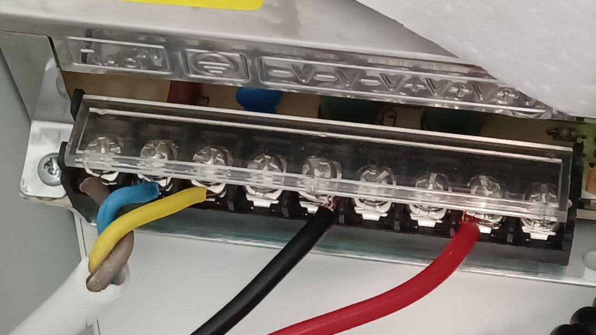|
|:---------------------------------------------------------------------------------------------:|
|Figure 2: Red (+) and Black (-) cables connected to appropriate power supply terminals

# Initial setup to allow boot from USB pendrive
This step is needed in order to enable the HERMES installer to run from a USB pendrive.
First connect a USB keyboard to the radio, and then connect the radio to the network cable (RJ45 type) with appropriate Internet connection. Then click in the Terminal icon shown in Figure 3.

|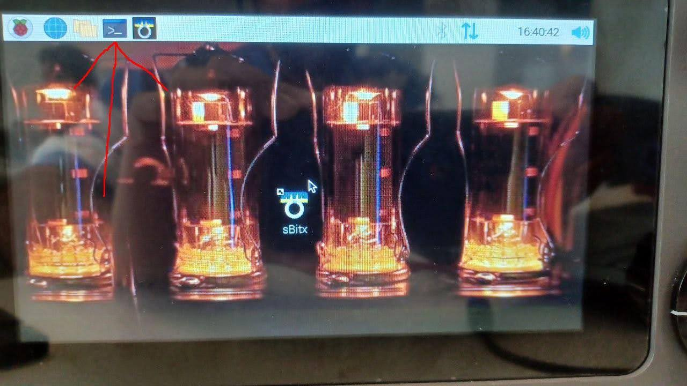|
|:---------------------------------------------------------------------------------------------:|
|Figure 3: Screen of the radio and the "Terminal" icon pointed by a red arrow.

After opening the terminal window, type:

* sudo su   then press Enter
* apt-get update   then press Enter
* apt-get install rpi-eeprom   then press Enter
* raspi-config   then press Enter 	
Some of the commands above may take some time to execute, just wait until the system is ready again to enter the next one.

At this point the screen shown in Figure 4 should appear.

|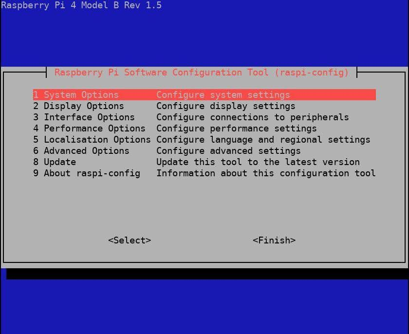|
|:---------------------------------------------------------------------------------------------:|
|Figure 4: Configuration software screen (raspi-config tool).

Choose the options of the menu in the following order using the keyboard arrow and Tab keys (as shows in Figures):

* Step 1: Option 6 (Advanced Options) - figure 5
* Step 2: Option A6 (Boot Order) - figure 6
* Step 3: Option B2 (USB Boot) - figure 7
* Step 4: Finish - figure 8

|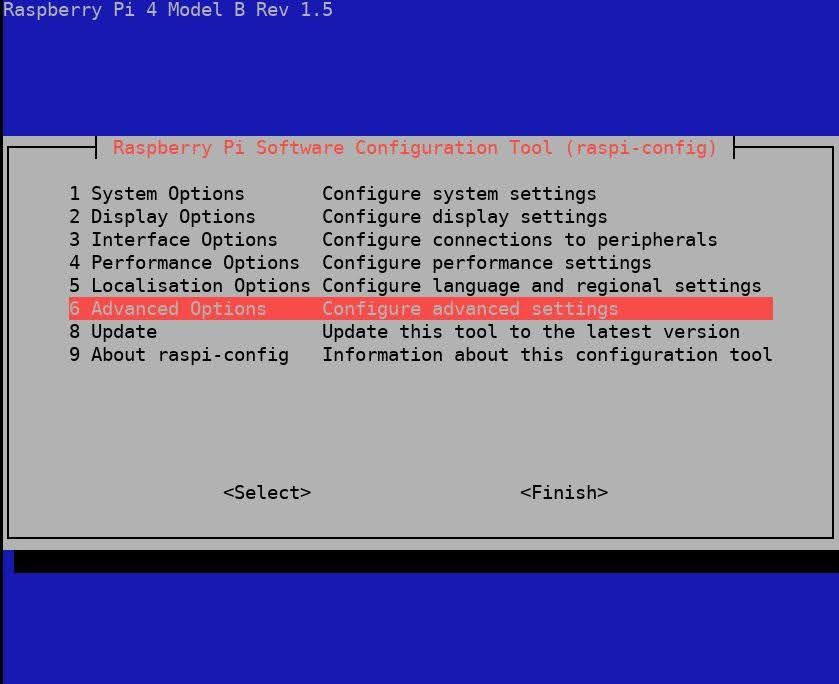|
|:---------------------------------------------------------------------------------------------:|
|Figure 5: Menu option to select (step 1)

|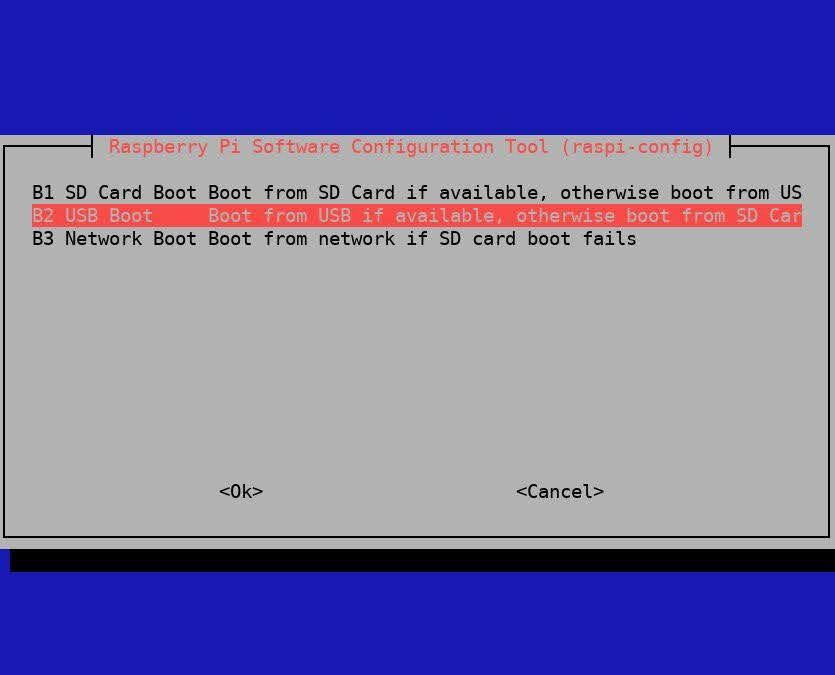|
|:---------------------------------------------------------------------------------------------:|
|Figure 6: Menu option to select (step 2)

|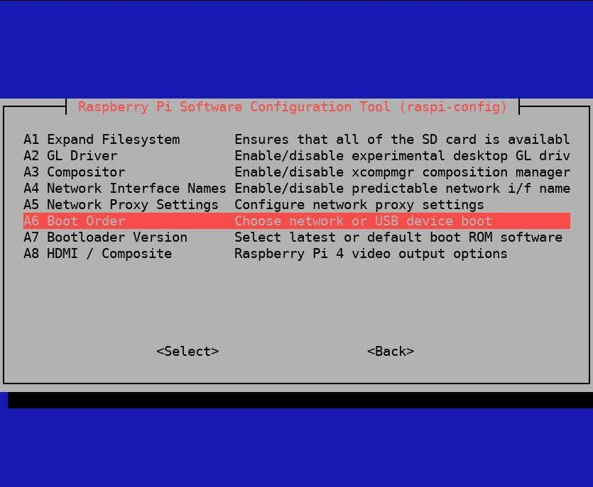|
|:---------------------------------------------------------------------------------------------:|
|Figure 7: Menu option to select (step 3)

|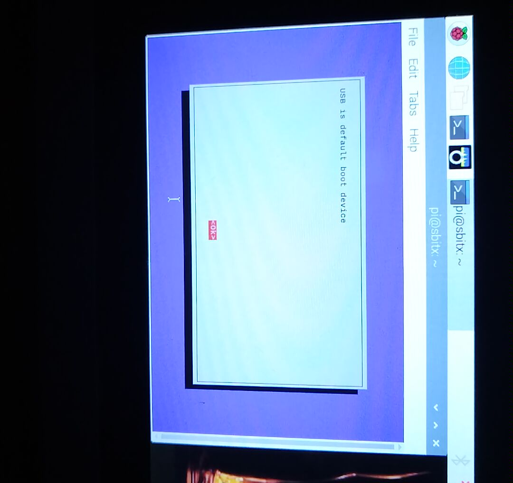|
|:---------------------------------------------------------------------------------------------:|
|Figure 8: Finish

Accept the option to reboot the radio. Now the radio is ready to run the HERMES installer. 

## HERMES USB installer preparation

A USB pendrive of at least 8 GB is needed. A computer is needed to prepare the USB pendrive.

The installer should be downloaded from: https://aco-connexion.org/downloads/installer-image-v3.img.zip

After the download is finished, the file should be "unzipped", as shown in Figures 8, 9 and 10. The extracted file should have the name: "installer-image.img".

|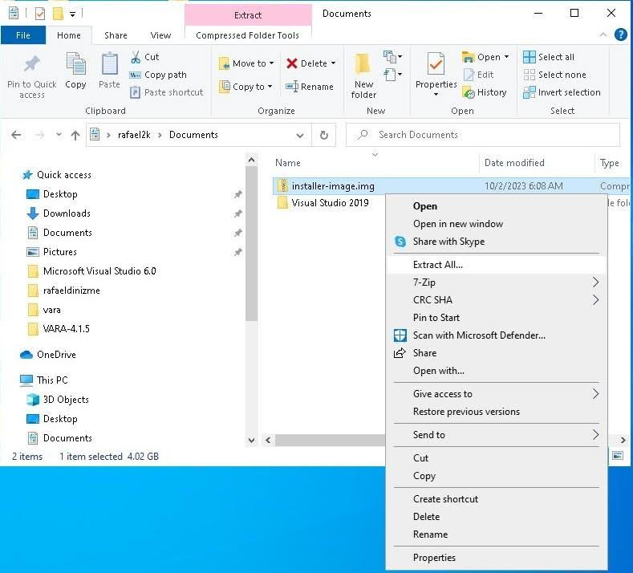|
|:---------------------------------------------------------------------------------------------:|
|Figure 9: Unzipping the installer file.

|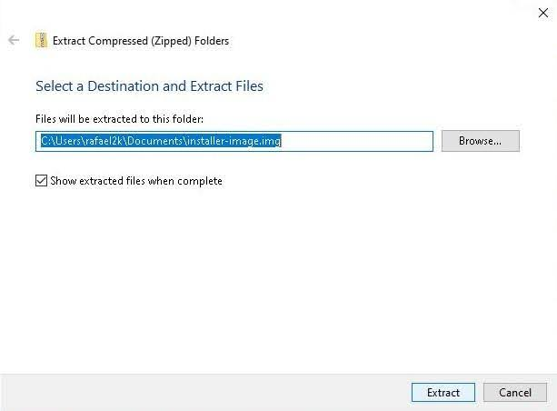|
|:---------------------------------------------------------------------------------------------:|
|Figure 10: Setting the installer file name.

|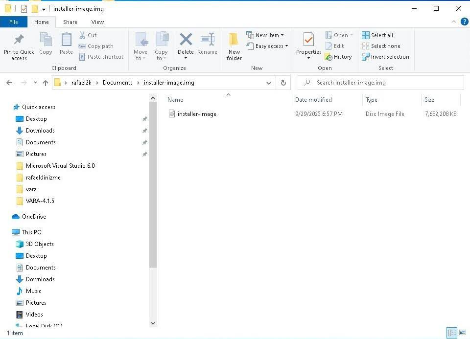|
|:---------------------------------------------------------------------------------------------:|
|Figure 11: Installer file after unzip

Then, for copying the installer to the USB pendrive, use the following software (or other raw image writer or flasher), called Etcher (supported on Windows, MacOS and Linux), available in https://etcher.balena.io/. The download is available on this website, as shown in Figure 11 (eg: for Windows choose the first option). If the link is blocked, use https://etcher.fr.uptodown.com/windows/telecharger 

|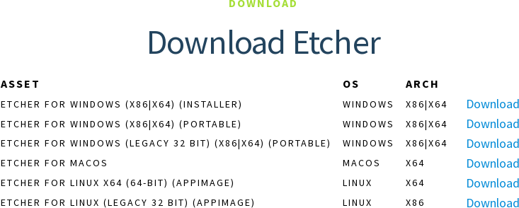|
|:---------------------------------------------------------------------------------------------:|
|Figure 12: Download options for Etcher software.

Run the software Etcher and choose the option "Flash from file" and select the file "installer-image.img", as shown in Figures 13, 14 and 15.

|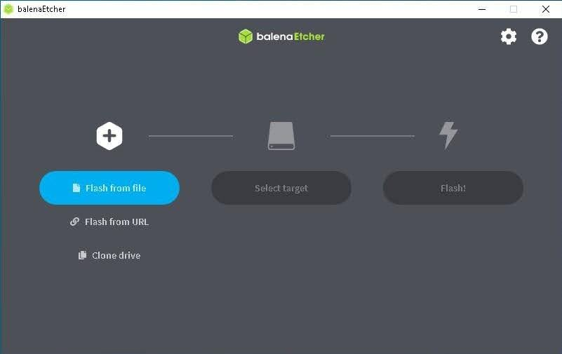|
|:---------------------------------------------------------------------------------------------:|
|Figure 13: First screen of Etcher, "Flash from file" selected.

||
|:---------------------------------------------------------------------------------------------:|
|Figure 14: Choose the file "installer-image".

|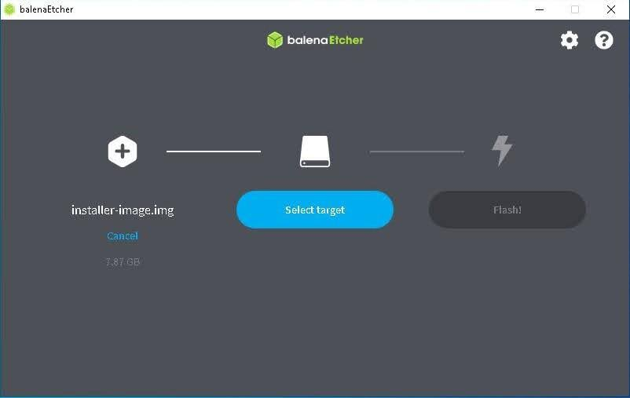|
|:---------------------------------------------------------------------------------------------:|
|Figure 15: Select the USB pendrive to be used as installer

Then click “flash”.

The copying of the file can take a few minutes.

After the copying is finished, insert the USB pendrive with the HERMES installer into the radio, as shown in Figure 15. Make sure the radio is turned OFF before inserting the USB pendrive.

|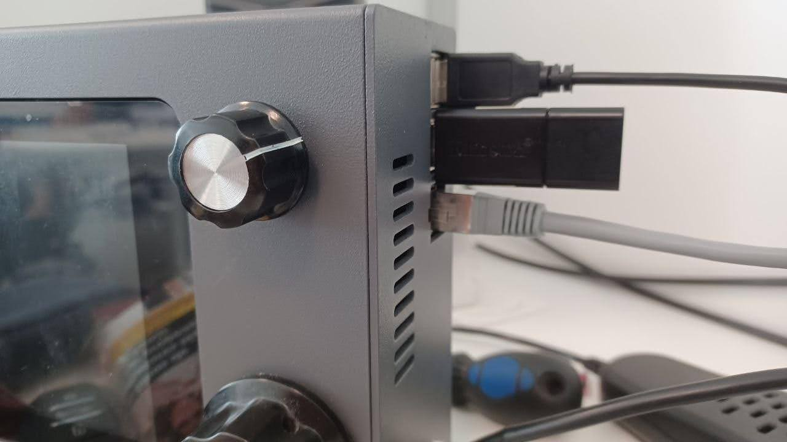|
|:---------------------------------------------------------------------------------------------:|
|Figure 16: Radio with USB pendrive connected together with keyboard and network cable.

## HERMES installation

The HERMES installation procedure will set up the sBitx v3 radio with the HERMES system, and perform the station-specific setup

The installation is done in two steps. The first one with the USB pendrive inserted in the radio, and the second without the pendrive.

After preparing the USB pendrive and plugging it to the radio, turn on the radio. It is also necessary to connect a keyboard to the radio.

When asked if you want to proceed with the installation, answer "y" and press ENTER, as shown in Figure 17.

|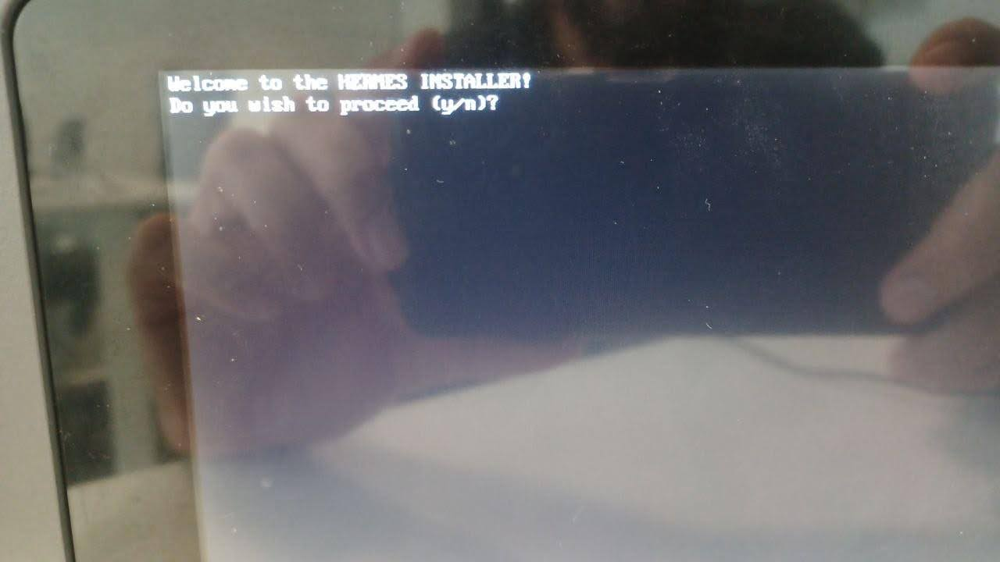|
|:---------------------------------------------------------------------------------------------:|
|Figure 17:  HERMES interactive installer starting.

When asked if you want to write HERMES (copy the system), answer "y" and press ENTER, as shown in Figure 18.

|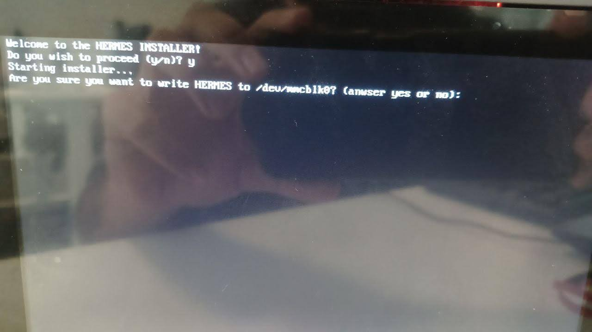|
|:---------------------------------------------------------------------------------------------:|
|Figure 18:  HERMES installer question to start writing to internal radio memory.

Then the installer will copy the HERMES system (Figure 19) to the internal radio SD card, which will take some time, most likely more than one hour.

|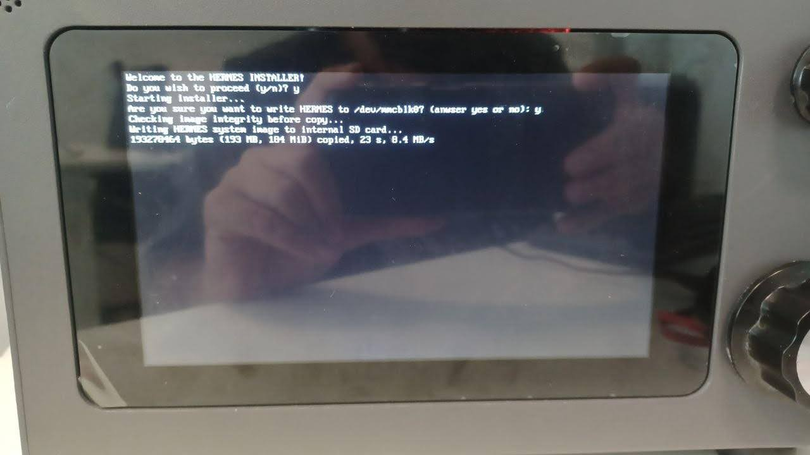|
|:---------------------------------------------------------------------------------------------:|
|Figure 19:   HERMES installer in process of copying data to internal radio memory.

After the copying is done (shown in Figure 20), reboot the radio (just press any key) and REMOVE the pendrive from the radio for the second step of the installation. Also make sure the network cable (Internet) is connected to the radio.

|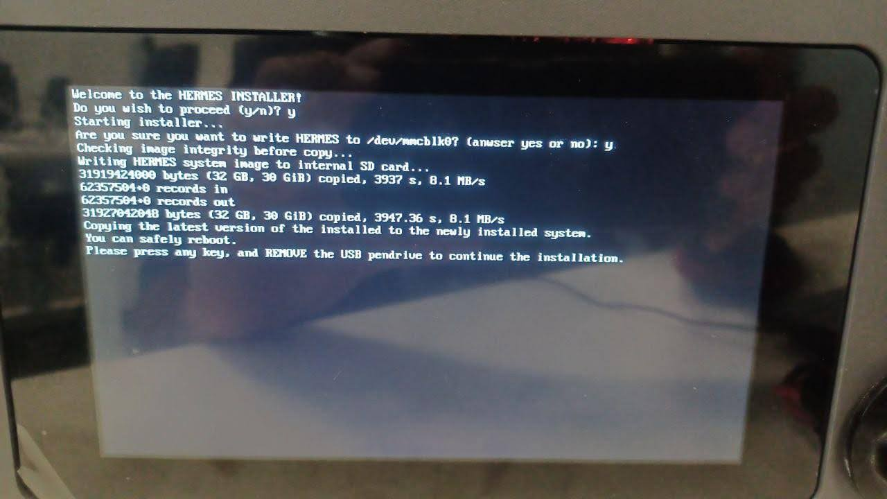|
|:---------------------------------------------------------------------------------------------:|
|Figure 20: HERMES installer finished copy of the system to internal radio memory.

The restart of the radio may take a very long time, and when the radio reboots it may show a multi-color screen for a while. If this is the case, just wait, making sure the radio remains powered and connected to the Internet with the RJ45 cable.

After the radio restarts, you will be asked about the station name to use, as shown in Figure 20 and 21. Choose one of the station names below, by typing the full station name in the installed prompt. For example bangassouhub.aco-connexion.org or bakouma.aco-connexion.org

The station "bangassouhub.aco-connexion.org" has the gateway station setup (this is why there is “hub” in the name). The gateway station should be deployed in a place with Internet connection in order to route information coming from remote stations that do not have internet.

|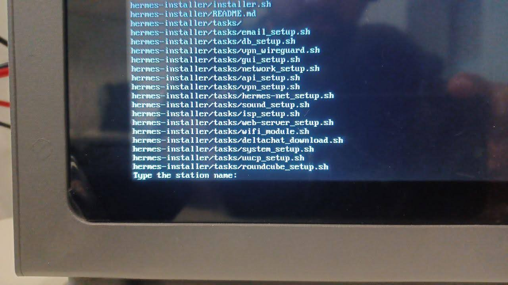|
|:---------------------------------------------------------------------------------------------:|
|Figure 21: HERMES installer station name prompt.

|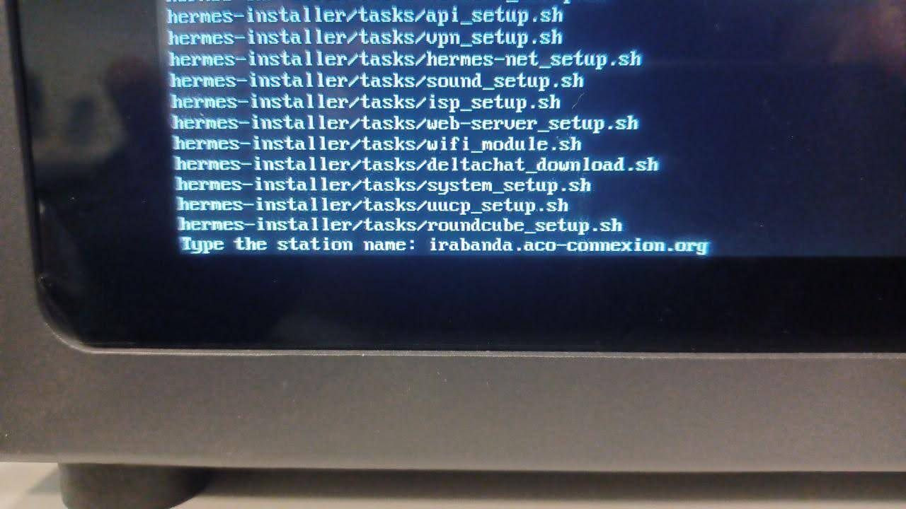|
|:---------------------------------------------------------------------------------------------:|
|Figure 22: Station name field filled with "irabanda.aco-connexion.org".

After the setup is finished, you should see the following message "Press any key to REBOOT the radio...", as shown in Figure 23. Press any key to Reboot. The installation process is finished.

Note it may take several minutes between entering the station’s name and the completion of the installation process - this is normal.

|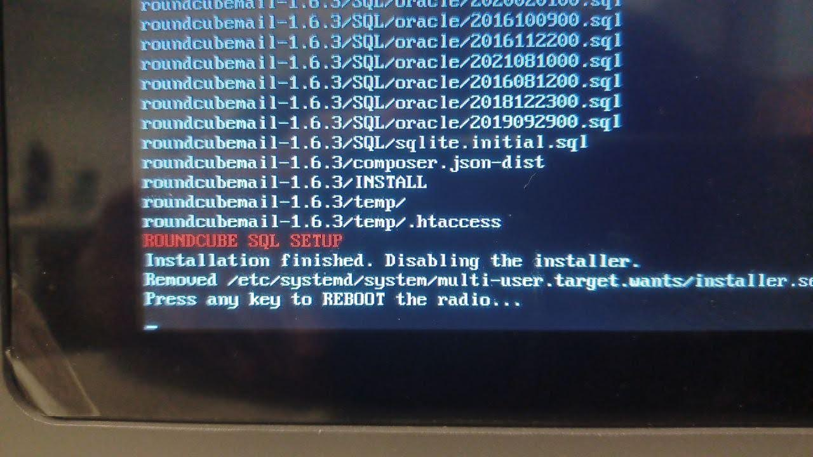|
|:---------------------------------------------------------------------------------------------:|
|Figure 23: Message that marks the end of installation.

The radio will restart, and the HERMES interface will show up, as shown in Figure 24.

||
|:---------------------------------------------------------------------------------------------:|
|Figure 24:  HERMES language selection.

|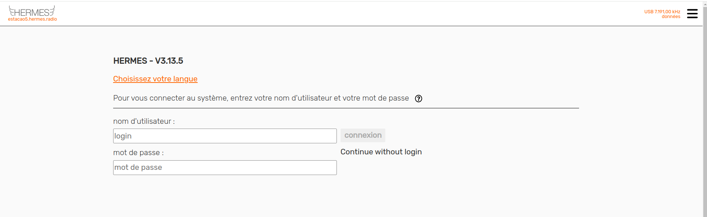|
|:---------------------------------------------------------------------------------------------:|
|Figure 25:  HERMES language selection.

## WiFi Setup

When the radio restarts you need to first log-in.

||
|:---------------------------------------------------------------------------------------------:|
|Figure 25:  HERMES language selection.

In order to log-in to the HERMES User Interface (UI)., For your first access use the root credentials,  a default password is set (that can be changed), and it is:

user name: root
password: caduceu

Then, once logged in, go to the Wifi configuration menu.

|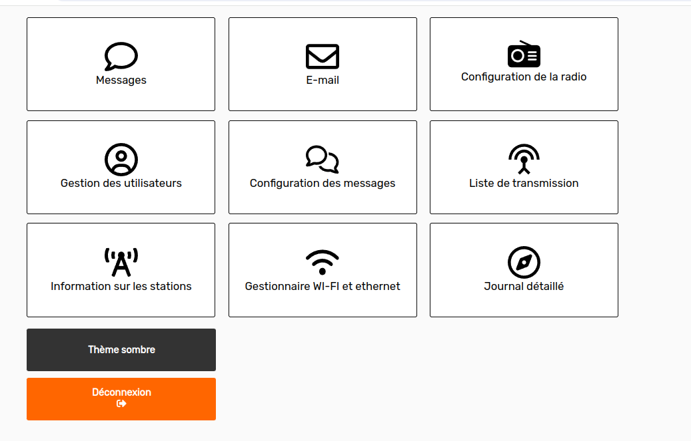|
|:---------------------------------------------------------------------------------------------:|
|Figure 26:  HERMES home screen

The Wifi settings can be changed through the HERMES interface, as shown in Figures 27. Choose a network name only with lower case letters and numbers. The password needs to be at least 8 characters, and the use of special characters or spaces is not allowed - use just lower case letters and numbers. The Wifi channel also needs to be chosen, being one of the allowed channel numbers that range from 1 to 11. Any channel can be chosen. In case two or more HERMES radios are in the same room or in proximity, choose a different channel and network name for each radio.

|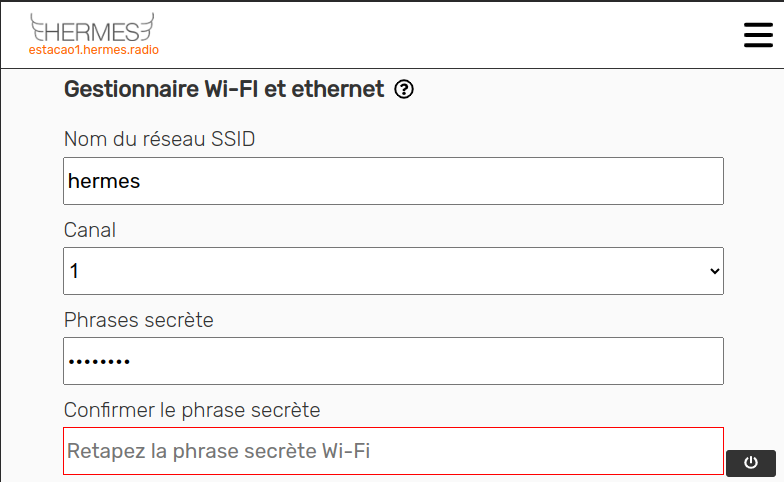|
|:---------------------------------------------------------------------------------------------:|
|Figure 27: WiFi administrative interface.

## Radio Frequency (RF) connections assembly

For proper testing, the radio needs to be connected, ideally, to a power meter (also called watt meter), which should be connected to a dummy load, as shown in Figures 28 and 29.

|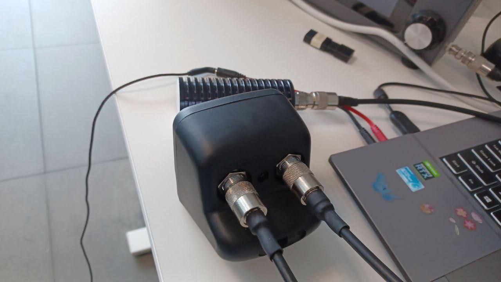|
|:---------------------------------------------------------------------------------------------:|
|Figure 28: Back of the power meter with the cables attached.

|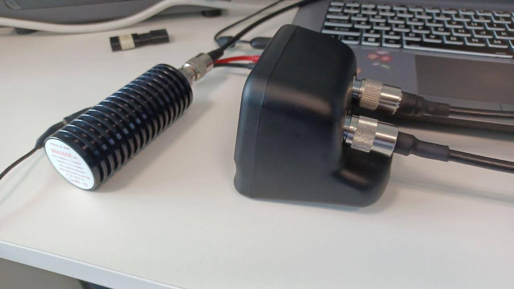|
|:---------------------------------------------------------------------------------------------:|
|Figure 29: Both the dummy load (left) and the power meter (right).

The radio (sBitx v2) has a BNC female connector, and needs the appropriate cables and adapters to be connected to the Wattmeter and dummy load (eg. by using BNC Male to UHF/SO239 Female). The wattmeter measures the forward and reflected power of the radio, and the dummy load simulates an antenna without radiating the signal.
The radio needs to be connected (see Figure 31) to the "TX" or "Transmitter" (see Figure 30) port of the power meter, while the dummy load should be connected to the "ANT" or "Antenna" port.

|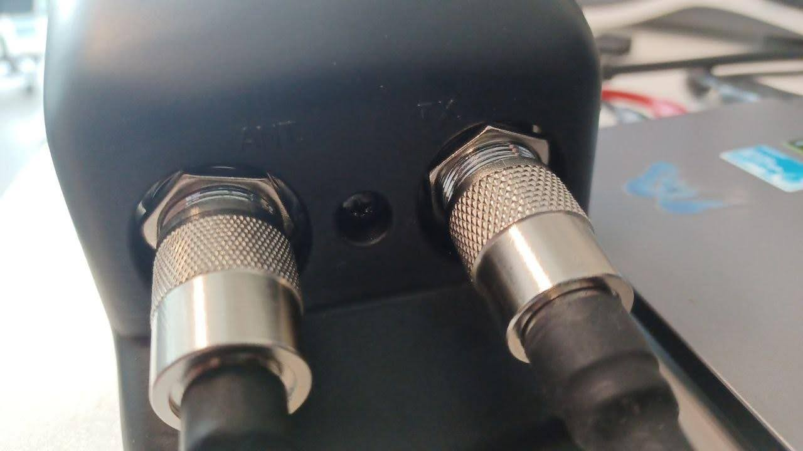|
|:---------------------------------------------------------------------------------------------:|
|Figure 30: Back of the power meter in which the ANT and TX writings can be seen.

|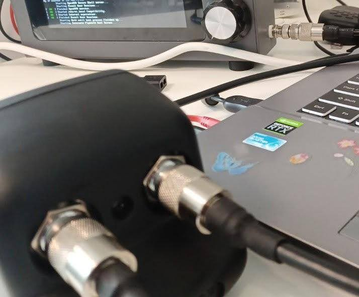|
|:---------------------------------------------------------------------------------------------:|
|Figure 31: The power meter (left) and radio with the connected cable (top right).

Make sure the cables are properly connected and the front of the power meter (Figure 32) is in a visible position.

|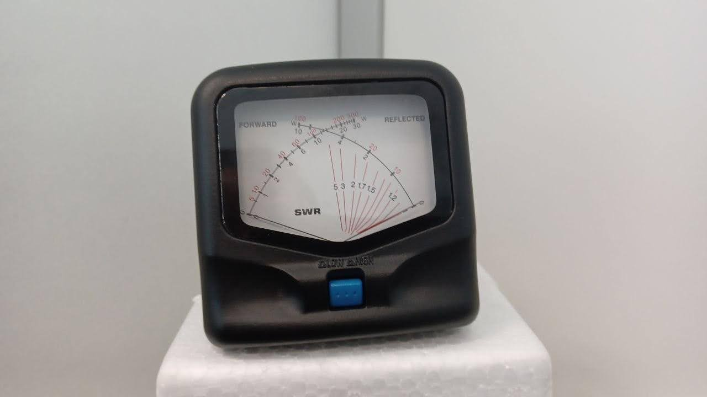|
|:---------------------------------------------------------------------------------------------:|
|Figure 32:  Front view of a power meter

## RF test

After all the RF connections are ready, a transmit test needs to be made. First, set a VOICE frequency in the band you will operate most frequently on the radio (Eg. 6200 kHz). Then two tests should be carried:

 * Voice test with the microphone, for microphone and its button operation check
 * Single tone test, for establishing the power level of the radio

Before performing the voice test, you need to first activate the PTT. go to the “settings” menu and there toggle the button to activate the PTT. then return to the main menu and go to the voice menu.

To enter the voice screen in HERMES UI, follow Figures 33 and 34.

|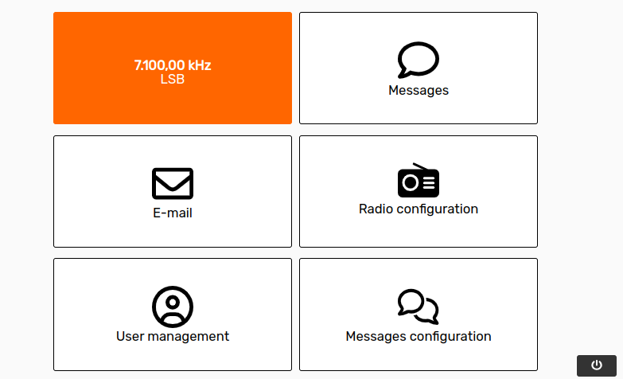|
|:---------------------------------------------------------------------------------------------:|
|Figure 33: HERMES UI with a finger pointing to the voice functionality icon.

In between figure 33 and 34,  set a VOICE frequency in the band you will operate most frequently on the radio.

||
|:---------------------------------------------------------------------------------------------:|
| Figure 34:HERMES UI in the voice screen.

|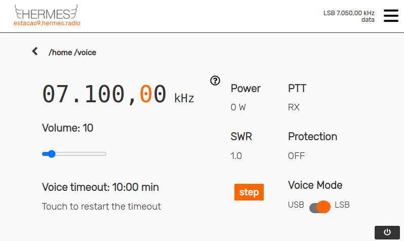|
|:---------------------------------------------------------------------------------------------:|
| Figure 35:HERMES UI in the voice screen.

The expected result of the voice test, when talking with normal voice level, should be the watt meter having an oscillating power level, ranging from 0 to 20W.
In order to carry out the single tone test, enter the radio configuration screen, as shown in Figure 33. The single tone functionality is enabled using the "PTT" button in the radio configuration page, as shown in Figure 34. When toggled, the transmitter of the radio will engage and put out a steady tone at constant power until the toggle is switched off.

|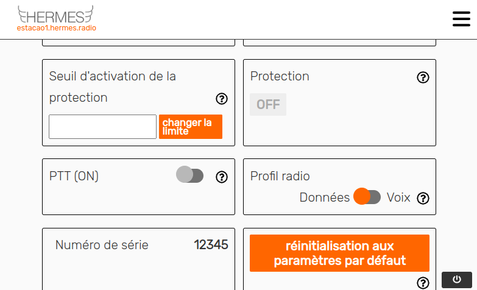|
|:---------------------------------------------------------------------------------------------:|
| Figure 37: HERMES UI in the radio configuration page, an arrow points to the "PTT" button.

The expected result of the single tone test, should be a power reading of approximately 20 W, as shown in Figures 38 and 39. 

|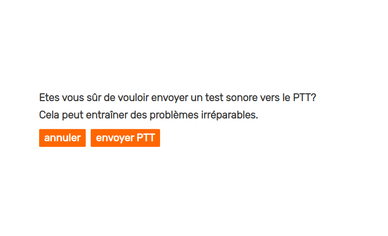|
|:---------------------------------------------------------------------------------------------:|
| Figure 38: Confirmation question shown after clicking to enable the PTT.

|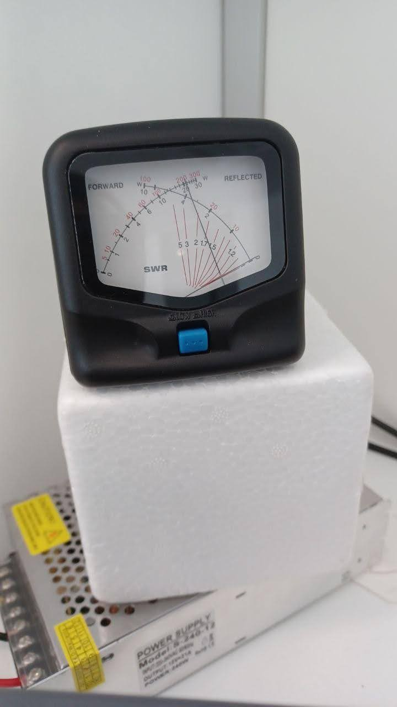|
|:---------------------------------------------------------------------------------------------:|
| Figure 39: Wattmeter showing 20W of power.

## E-mail setup and test

In this section the process of creating one or more users in the HERMES system is addressed. Also the process of connecting a device (eg. tablet or cellphone) to the radio over WiFi and using the software DeltaChat (an email client) for messages exchange.

In the HERMES interface, create the email “operateur” (the rest of the email account is created automatically, do not enter it when creating the email) , to be used for the email access. Then connect the companion device to the radio WiFi network, and install the software DeltaChat (an email client). Follow the steps shown in Figures 40 and 41 in order to create users in the HERMES UI.

|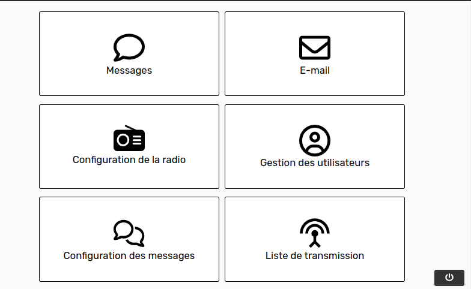|
|:---------------------------------------------------------------------------------------------:|
| Figure 40: User management icon in main HERMES page.

|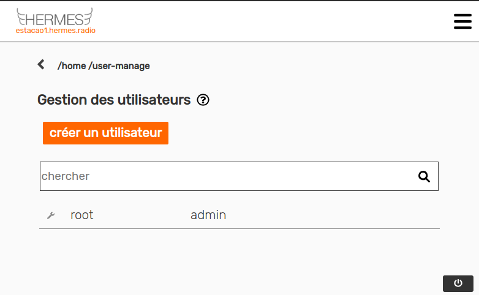|
|:---------------------------------------------------------------------------------------------:|
| Figure 41: User management screen.

Create a new user by  clicking create new user

The first field email corresponds to your email account that you are going to use as your HERMES access credentials, and seeder and receiver email account. 

The second field Name you must use is your real name to fill up that input and double check it because it cannot be changed. (see figure 42)

Phone number is a contact that can also be used for communication between users and communities. It is important complementary information so provide your mobile phone number correctly with your Country code (+1) if you have one. (see figure 42 and 43)

Be sure that you will remember your password after creating your user. You need to remember your email and password for the HERMES system and the Webmail tool access.
It must contain at least 6 characters. (see figure 42 and 43)

If you want to create and administrator user press “Is administrator” toggle, if you want to create a common user leave that option OFF (see figure 42).

Then confirm your new user by clicking create.

|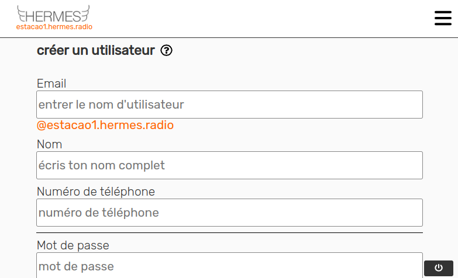|
|:---------------------------------------------------------------------------------------------:|
| Figure 42: Create user screen.

The device (tablet) should be set up with a password, and the password should be recorded in the IC google sheet document tracking all of the radios and tablets. Please make sure that the tablet assigned to the given radio/community is the one that has the MAC address that is assigned to that same community in the IC google sheet document.

On the tablet, open the Wifi and connect to the network named “hermes”.
The password is “amazonia”.

Once connected, you’ll be redirected to the same interface as seen in the radio.

Open the browser and access …
Accept Security warning (screenshot)
Save on your desktop… (screenshot)

Login again…
 
Click Email. Then go to DeltaChat.
Through the Deltachat app, you can use emails to conduct personal message exchanges (similar to WhatsApp or SMS).

Then install and open the DeltaChat application, which is compatible with your system (Android/IOS/Deian/MacOSX)available in any app store.
DeltaChat can also be installed on the tablet locally from the radio’s memory, as shown in Figure 39 and then, by clicking the DeltaChat icon, download links will appear, as shown in Figure 40.

||
|:---------------------------------------------------------------------------------------------:|
|Figure 26:  HERMES home screen

|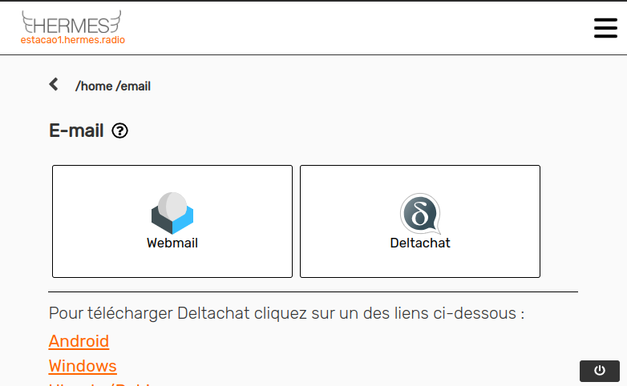|
|:---------------------------------------------------------------------------------------------:|

|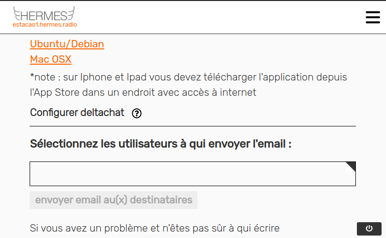|
|:---------------------------------------------------------------------------------------------:|
| Figure 43:  User management icon in main HERMES page.

After downloading and installing Delta Chat on your device, open the Delta Chat app and follow the next steps.

The HERMES system includes a compression system. End-to-end encryption should be disabled in order to allow the server-based image and audio compression to work properly, otherwise image and audio exchange will not be possible.

The steps to find this feature in Deltachat are: -> Advanced -> Autocrypt, Prefer End-To-End Encryption: turn off. delivered.

If you wish, you can also turn on email delivery monitoring to check if your emails were correctly sent.

|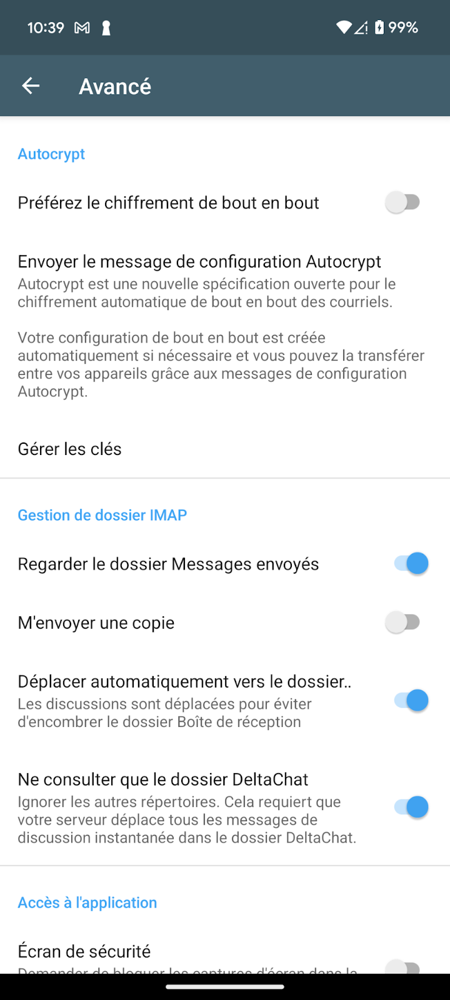|
|:---------------------------------------------------------------------------------------------:|
| Figure 45:  DeltaChat login screen, with email and password fields shown.

Deltachat, by default, tags its emails and shows only the "known" messages (emails) that were sent by another Deltachat application. 

In order to be able to interact with emails from any email client software, enable the option "show all emails". The steps to find this feature in Deltachat are: Burger Menu  -> Settings -> Chats and Media -> Show Classic -> EMails -> All.

|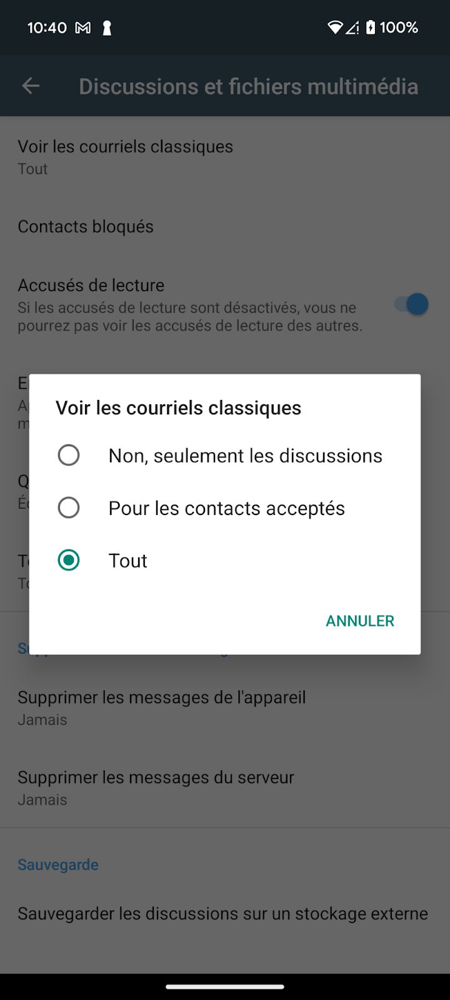|
|:---------------------------------------------------------------------------------------------:|
| Figure 46:   DeltaChat login screen, with email and password fields shown.

After tag Show All Classic E-Mails you must turn off the read receipts in the same screen (Settings -> Chats and Media -> Read Receipts) to avoid receipts that will consume your band and storage with large confirmation emails.

||
|:---------------------------------------------------------------------------------------------:|
| Figure 47:   DeltaChat login screen, with email and password fields shown

In order to configure DeltaChat, first an email account should be created, on the create user session, accessed through admin or email link on the main menu. In order to login to an email account, only the email address and password fields should be filled, as shown below. The user and password will be the same as those created when first creating a login on HERMES and for use with the RoundCube webmail, such as: username@{{domain}}.

|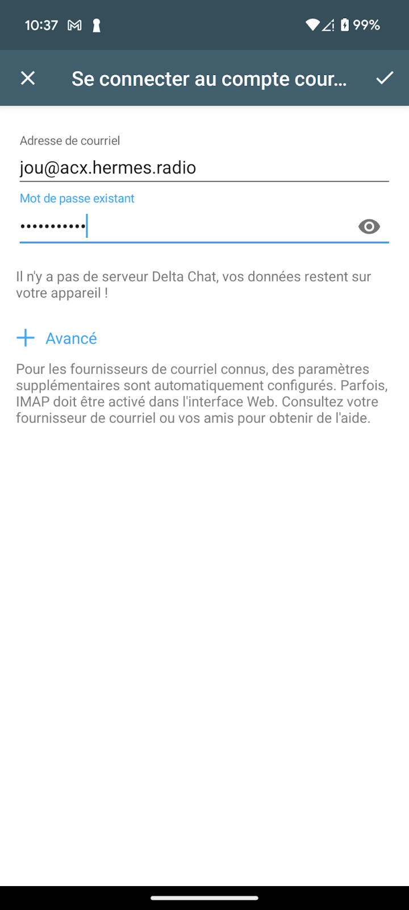|
|:---------------------------------------------------------------------------------------------:|
| Figure 48:   DeltaChat login screen, with email and password fields shown.