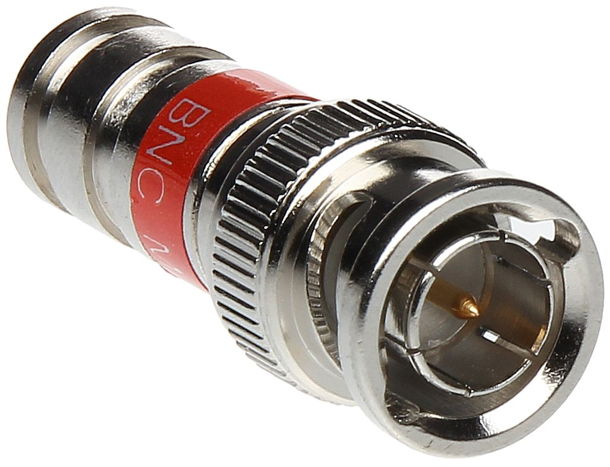
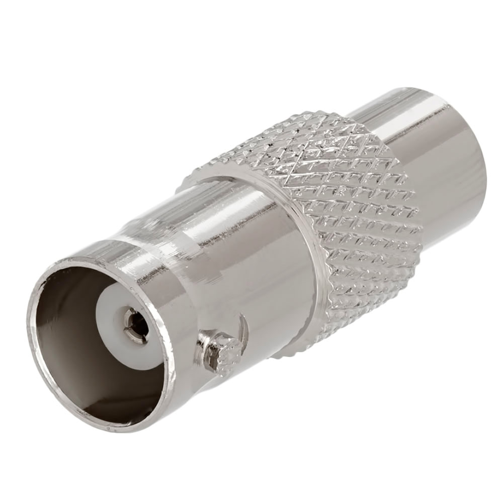
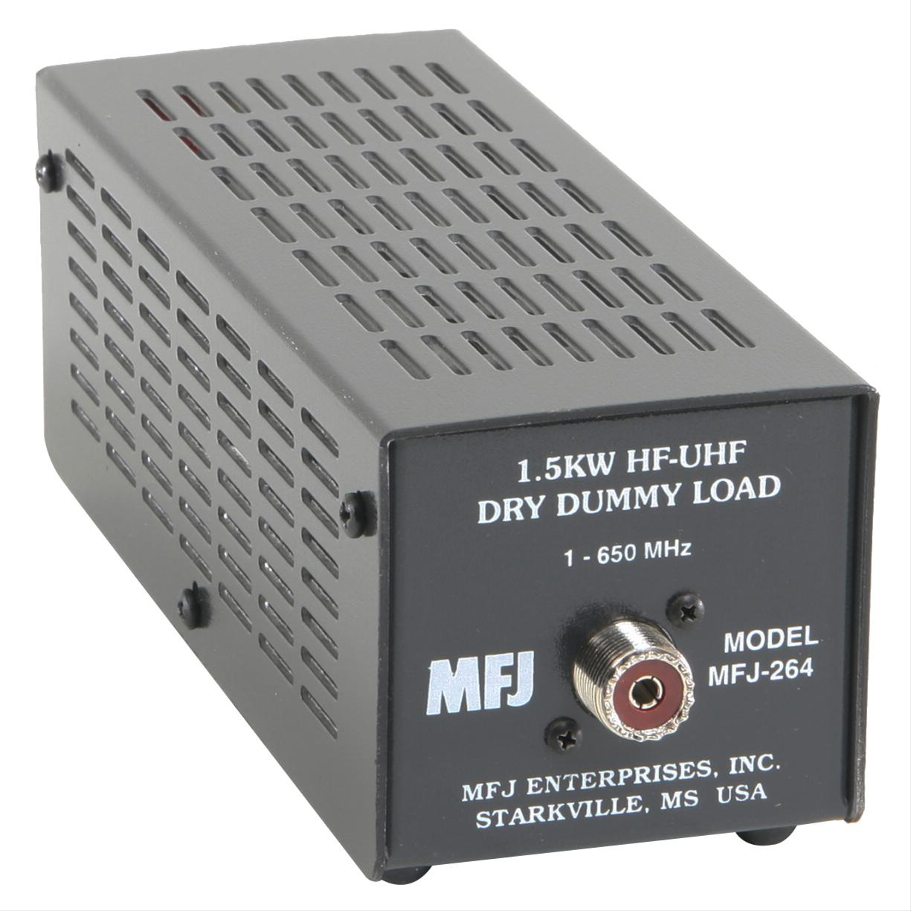
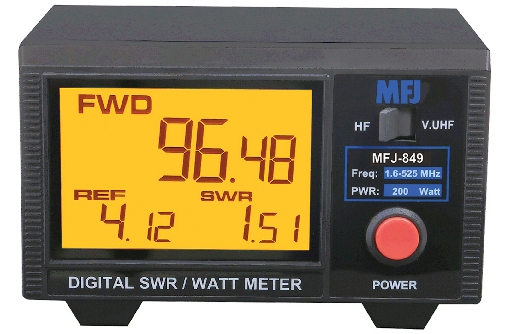
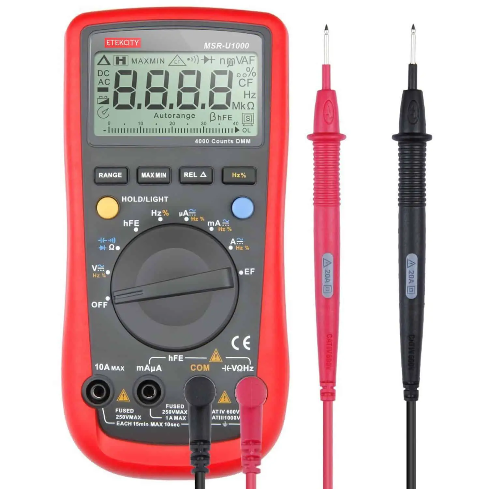
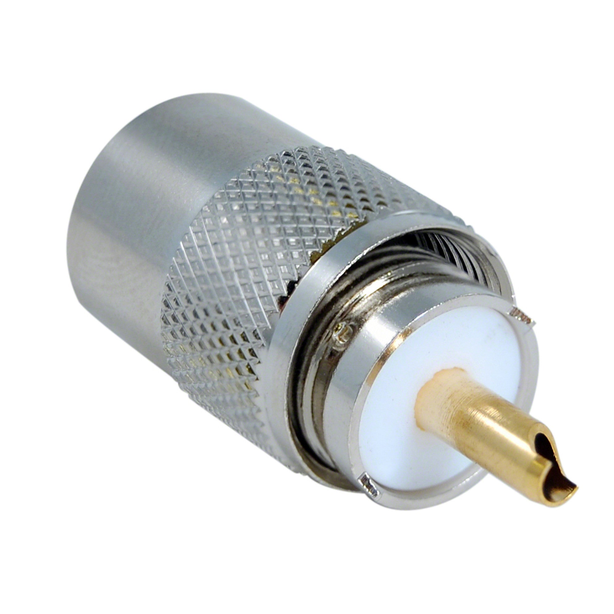
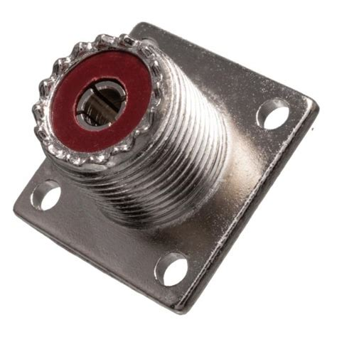

## HF Radio Step-by-Step Troubleshooting Guide

1. Connect the radio to the antenna by plugging in the coaxial cable that connects the radio to the antenna;

2. Transmit (use the HERMES "PTT" button in radio config)

3. After reading the SWR, turn off the "PTT"

4. If the SWR is lower than 2.0, the station is ready to be used!

5. If the SWR is higher than 2.0, follow the following checks

In order to transmit a test signal, go to “Radio configuration”:

||
|:---------------------------------------------------------------------------------------------:|

Then click to turn ON the “PTT” button. Check the “Power” level, which should be between 15W and 30W. Check the SWR, which should be less than 2.0. Check the “Protection”, which should be “OFF”. After the readings, click to turn OFF the “PTT” button. 

||
|:---------------------------------------------------------------------------------------------:|

If the protection stays “OFF” after the transmission test, and the Power and SWR readings are in the correct ranges, the HERMES system is ready for operation and you can stop here. If either Power and SWR are not in the correct ranges or if the protection is on follow the steps in this guide to resolve the issue.

For properly assessing the HF station problems, the following equipment is necessary:
   - Multimeter which can measure voltage
   - HF watt meter
   - 2x small 50 Ohm coaxial cables with UHF connector for connecting the radio to wattmeter, and wattmeter to dummy load. You might need a UHF-female to BNC-male adapter of use with the sBitx radio.
   - 50 Ohm dummy load 

Assure that the measurement equipment is working previously.

# Initial Equipment Checks

## Check the cable:
 - Test the continuity of the cable (both center pin and outside conductor) and if the outside and center conductors are not short-circuited with a multimeter 
 - Analyze the overall cable situation 
   - - check for visibly broken parts of the cable

## Check the radio:
 - Check that the radio has all the necessary cables for connection 
 - Check the voltage in the input of the radio (should be between 12 and 14V) 
 - Test the continuity of the power cable
 - Connect the power cable to the radio
 - Check that the radio turns on correctly 
 - Test the buttons and see if everything seems correct (volume, frequency) 
 - Check if the radio is too hot, and if it is, there can be a problem in the radio. Turn off the radio and contact support.
 - Check that it doesn't smell burnt, if yes, there is a problem in radio, turn it off immediately
## Check the antenna:
 - Check the radio to antenna connections
 - Check if the antenna is well installed and hanging properly in the poles
 - Check for any broken parts and avoid any elements touching the antenna
 If all the above checks are completed without identifying the problem, and when transmitting through an antenna, the SWR is still high, proceed to the following steps:
 
  - Connect the radio to the watt meter and dummy load
  - Check the SWR:
    - - if lower than 2.0 (typically it should be 1.0 or 1.1 in the dummy load), the radio is working fine, and if there is a problem when transmitting with the antenna, the problem is likely to be in the coaxial cable, or in the antenna itself;
    - - if higher than 2.0, then most likely there is a problem with the cables (or its connectors) or even the dummy load.

 - When the SWR is higher than 2.5 (value set by default in the radio, but can be changed), the radio will cut the transmission and will enter "protected mode", in which the radio will not transmit again until the protection is reset (button available in radio config in the UI). So if the protection is activated at any point, it can be assumed that the SWR is higher than 2.5. Go to the top of the checklist and begin again by checking everything. SWR problems are almost always related to either the antenna, the coaxial cable between the antenna and the radio or the cable connectors.

&nbsp;

# GLOSSARY

BNC CONNECTOR: Common radio frequency connector.
||
|:---------------------------------------------------------------------------------------------:|
|BNC male

||
|:---------------------------------------------------------------------------------------------:|
|BNC female

DUMMY LOAD: A dummy load or termination load, is a device used in electronics to simulate the electrical load that a piece of equipment would encounter under normal operating conditions. Dummy loads are typically resistors or other types of load elements designed to dissipate electrical energy in the form of heat. They are commonly used in testing and troubleshooting electronic circuits, amplifiers, transmitters, and other equipment to ensure proper operation and prevent damage to sensitive components, without the need to connect it to a real load, such as an antenna. 
||
|:---------------------------------------------------------------------------------------------:|
 

WATT METER: Measures the power coming out of the radio and also the reflected power or SWR. Ensure use of a watt meter that is compatible with HF frequencies between 3 and 30MHz as well as up to 20 Watts of power output minimum.

||
|:---------------------------------------------------------------------------------------------:|
 

MULTIMETER: Short for "multiple meter," it is an electronic instrument used to measure various electrical quantities such as voltage, current, and resistance. It is an essential tool for electricians, electronics technicians, and hobbyists working with electrical circuits and systems.

||
|:---------------------------------------------------------------------------------------------:|
 
PTT: Stands for "Push-to-Talk." It is a communication method commonly used in two-way radio systems, walkie-talkies, and similar devices. With PTT, users activate their microphone by pressing a button or switch (usually located on the side of the device) while speaking and release it when they finish speaking.

SWR: Stands for Standing Wave Ratio. It is a measure used in radio frequency (RF) engineering and telecommunications to assess the impedance matching between transmission lines (such as coaxial cables) and the load (such as antennas) connected to them. High SWR values can lead to decreased efficiency, increased power losses, and potential damage to the radio transmitter or other equipment. An SWR of 1:1 indicates perfect impedance matching, with no reflections. An SWR greater than 1:1 indicates that there are reflections occurring along the transmission line due to impedance mismatch. Above 1:1.5 radio equipment should be turned off and an analysis should be done of the cable and antenna.

UHF Connector: Common radio frequency connector.

||
|:---------------------------------------------------------------------------------------------:|
| Male or PL type UHF Connector

||
|:---------------------------------------------------------------------------------------------:|
| female or SO type UHF Connector

UI: Stands for User Interface. This is what appears on the screen of the radio with which the radio operator interacts to set parameters and operate the radio.

