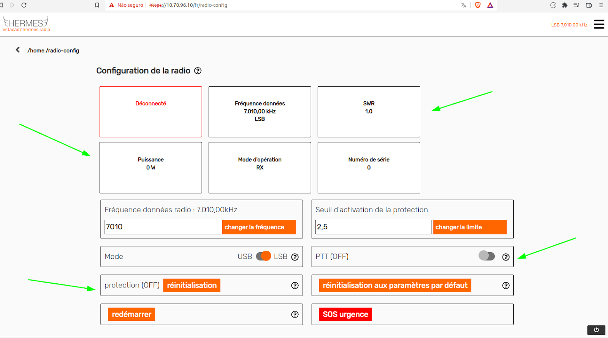

## HF Radio Step-by-Step Troubleshooting Guide

**1. Connect the radio to the antenna by plugging in the coaxial cable that connects the radio to the antenna;**

**2. Transmit (use the HERMES "PTT" button in radio config)**

**3. - After reading the SWR, turn off the "PTT"**

**4. - If the SWR is lower than 2.0, the station is ready to be used!**

**5. - If the SWR is higher than 2.0, follow the following checks**

In order to transmit a test signal, go to “Radio configuration”:

||
|:---------------------------------------------------------------------------------------------:|

Then click to turn ON the “PTT” button. Check the “Power” level, which should be between 15W and 30W. Check the SWR, which should be less than 2.0. Check the “Protection”, which should be “OFF”. After the readings, click to turn OFF the “PTT” button. 

||
|:---------------------------------------------------------------------------------------------:|

If the protection stays “OFF” after the transmission test, and the Power and SWR readings are in the correct ranges, the HERMES system is ready for operation and you can stop here. If either Power and SWR are not in the correct ranges or if the protection is on follow the steps in this guide to resolve the issue.

For properly assessing the HF station problems, the following equipment is necessary:
   - Multimeter which can measure voltage
   - HF watt meter
   - 2x small 50 Ohm coaxial cables with UHF connector for connecting the radio to wattmeter, and wattmeter to dummy load. You might need a UHF-female to BNC-male adapter of use with the sBitx radio.
   - 50 Ohm dummy load 

Assure that the measurement equipment is working previously.

## Initial Equipment Checks

Check the cable:
    * Test the continuity of the cable (both center pin and outside conductor) and if the outside and center conductors are not short-circuited with a multimeter 
    * Analyze the overall cable situation 
       * check for visibly broken parts of the cable

