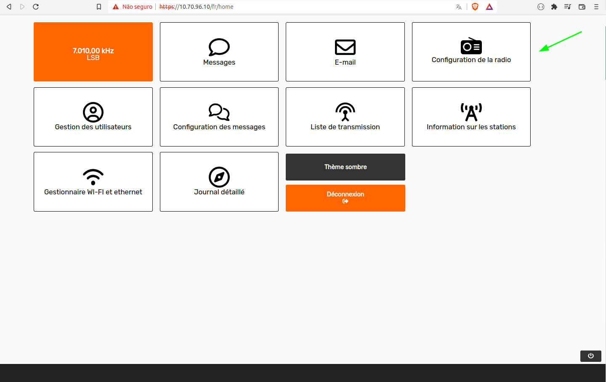

## HF Radio Step-by-Step Troubleshooting Guide

**1. Connect the radio to the antenna by plugging in the coaxial cable that connects the radio to the antenna;**

**2. Transmit (use the HERMES "PTT" button in radio config)**

**3. - After reading the SWR, turn off the "PTT"**

**4. - If the SWR is lower than 2.0, the station is ready to be used!**

**5. - If the SWR is higher than 2.0, follow the following checks**

In order to transmit a test signal, go to “Radio configuration”:

||
|:---------------------------------------------------------------------------------------------:|

Then click to turn ON the “PTT” button. Check the “Power” level, which should be between 15W and 30W. Check the SWR, which should be less than 2.0. Check the “Protection”, which should be “OFF”. After the readings, click to turn OFF the “PTT” button. 

||
|:---------------------------------------------------------------------------------------------:|
