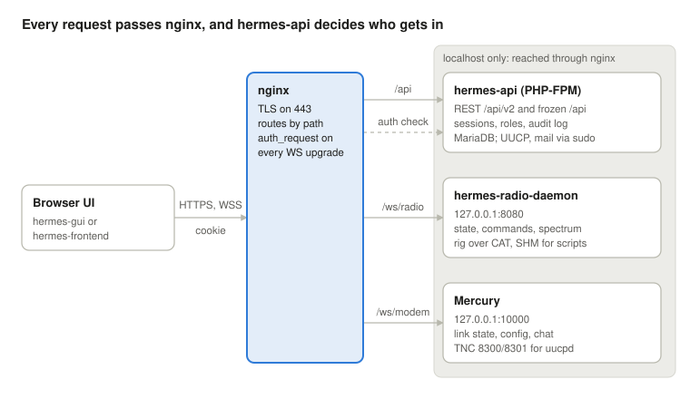

# HERMES UI ↔ backend API and hermes-api database redesign

2026-10-06 · Rafael Diniz · draft for review

> **Direction (2026-10-09).** The target architecture has changed: hermes-radio-daemon
> becomes the station's backend, including Mercury and serving the WebSocket and REST
> APIs. This document was written before that decision. Its survey of today's system,
> the `hermes.v1` protocol, the REST conventions, the database model and the security
> fixes still apply; the parts that assume hermes-api in PHP behind nginx `auth_request`
> will be revised. The station range is every Raspberry Pi from 1 GB to 16 GB. See
> [COMPARISON.md](COMPARISON.md) for the decision register.
>
> The tentative API for that backend is specified in [openapi.yaml](openapi.yaml) (REST,
> OpenAPI 3.1) and [asyncapi.yaml](asyncapi.yaml) (the `hermes.v1` WebSocket, AsyncAPI 3.1).
> Where this document and the hermes-backend docs disagree, each spec says which way it went
> and why.

## Summary

This design gives the station one front door, nginx on port 443, behind which there are two APIs. Live radio and modem state, and radio commands, travel over WebSockets served directly by hermes-radio-daemon and Mercury. Everything stored or done on the station's files and services stays REST in hermes-api, as a new `/api/v2`. hermes-api becomes the single place that authenticates users, both for REST and for opening a WebSocket. Its database is redesigned around messages with per-recipient delivery state, stations, schedules, settings and sessions.

Goals:

- **Secure by default.** Every route and socket requires a login. Roles are enforced on the server. No GET changes anything, and no user input reaches a shell.
- **One path per job.** Radio commands go straight to the radio daemon instead of through REST, `sudo` and shared memory. The UI stops polling for state the daemons can push.
- **One way of talking.** The same JSON envelope on both sockets, and the same conventions on every REST route: JSON, UTC timestamps, real booleans, one error format.
- **Compatible with deployed stations.** The `.hmp` message format, the UUCP and Postfix configuration, and the scripts that call the API keep working. The current `/api` stays up until every UI has moved.

Out of scope: the over-the-air protocols (UUCP, Mercury ARQ, NNCP) and the choice between hermes-gui and hermes-frontend. Both UIs can use this API.

Decision asked of the team: agree the architecture (next section) and the database model, so the work can be split up. The implementation starts with the security fixes to today's `/api`, which can ship before anything else.

## Current state

Today the UI reaches the station through two channels. It uses hermes-api over REST for everything it changes, including the radio. It uses the radio controller's WebSocket on port 8080 only to receive state. Neither UI connects to Mercury's own WebSocket (port 10000). hermes-api has no authentication: any client that reaches `/api` can reboot the station, create an admin, or erase the SD card.

| Component | Role today | Main problems |
| --- | --- | --- |
| hermes-gui (Angular, deployed) | Station UI: messages, users, radio, UUCP queue, schedules, Wi-Fi, GPS, logs | Admin checks only in the browser. Polls REST every 30 s for what the socket lacks: the other profile, the clock, digital voice. Calls `/sms/*` routes that do not exist |
| hermes-frontend (Next.js chat + GPS) | Newer chat and GPS apps that proxy to hermes-api | Unresolved merge-conflict markers in 13 files on `main`. Sends the file password as `?pass=` where the API reads `?i=`. No WebSocket, no polling for new messages |
| hermes-api (Lumen 11, PHP 8.2) | 120 routes in one file. About half run shell commands through `sudo` (uucp, gpg, tar, systemctl, sbitx\_client) | No auth middleware on any route. GETs with side effects (reboot, shutdown, uucico, erase). Shell injection in the user endpoints. Response shapes vary from route to route. One placeholder test |
| Radio controller WebSocket (radiod or sbitx\_controller, wss :8080) | Pushes `state` JSON and binary spectrum frames | radiod accepts about 60 commands on it, but the UI only listens: its commands go through hermes-api, `sbitx_client` and shared memory. Full state every 150 ms whether or not anything changed. No auth, version or request ids. Only the active profile is reported |
| Mercury UI WebSocket (:10000) | Used only by Mercury's own Fyne GUI | The station UI cannot see the modem's state: link, SNR, bitrate, transfer progress |
| Database (MariaDB `hermes`) | 6 tables: `users`, `messages`, `systems`, `caller`, `frequencies`, `custom_errors` | No foreign keys. Passwords stored as unsalted SHA-256. A message's state is two booleans, and no UUCP job id is kept. Settings live in a single row with no primary key. Arrays are stored as JSON columns |

Radio control today takes four hops: the browser calls hermes-api over REST, which runs `sudo sbitx_client -c set_frequency`, which writes shared memory, which the controller reads. The reply is the text `1`. The new value reaches the browser later, through the controller's socket.

Other scripts also call hermes-api, so they constrain any redesign:

- `iwatch` calls `GET /api/unpack/<file>` for every incoming message;
- `caller.sh` reads `GET /api/caller` and `GET /api/frequency/alias/{alias}`;
- `mailkill.sh` reads `GET /api/sys/language`.

An `nncp-transport` branch of hermes-api is also deployed on NNCP stations; this survey did not cover it.

## Proposed architecture

nginx is the only service the network can reach. It terminates TLS on 443 and routes by path. hermes-api answers it on every request and on every WebSocket upgrade. The daemons listen on localhost only and never handle passwords or certificates.

The browser only ever talks to nginx. The dashed line is the auth check that nginx makes before letting a WebSocket through to a daemon.

| Path | Goes to | Carries |
| --- | --- | --- |
| `/` | static UI files | hermes-gui or hermes-frontend |
| `/api/v2/*` | hermes-api (PHP-FPM) | REST: messages, users, stations, schedules, queue, settings, system actions |
| `/api/*` (v1) | hermes-api | Today's routes, frozen, behind login, until every client has moved |
| `/ws/radio` | hermes-radio-daemon, `127.0.0.1:8080` | Radio state, commands, spectrum, audio |
| `/ws/modem` | Mercury, `127.0.0.1:10000/websocket` | Modem link state, configuration, spectrum, chat |

How a request is authenticated:

1. The UI logs in with `POST /api/v2/session`. hermes-api sets a session cookie (`HttpOnly`, `Secure`, `SameSite=Strict`) and stores only a hash of the token.
2. For each REST request, hermes-api checks the cookie and the user's role itself.
3. For a WebSocket upgrade, nginx first calls `auth_request` on `/api/v2/session/check`. That returns 204 with `X-Hermes-User` and `X-Hermes-Role`, or 401, in which case the upgrade is refused. nginx forwards those two headers to the daemon and drops any copies the client sent.
4. The daemon trusts the headers because only nginx can reach it on localhost. It gates commands by role: `user` may only read, while `operator` and `admin` may also transmit and change settings.

Why direct sockets to each daemon, rather than relaying them through hermes-api:

- PHP-FPM cannot hold WebSockets. A relay would need a new long-running service, which becomes one more hop and one more thing that fails on a 1 GB Raspberry Pi.
- radiod and Mercury already serve WebSockets and already own their state. Each keeps its own release cycle.
- The two sockets share one envelope (next section), so to the UI they look like one API.

How the existing services change:

- radiod's static file server and its own TLS stay available for stations that run it without nginx.
- The rigctld (4532) and CAT (4534) servers move to localhost by default.
- Mercury's TNC ports (8300, 8301, 8100) already serve only local clients (uucpd, NNCP), so they bind to localhost too.
- `sbitx_client` and the shared-memory interface stay for scripts and for Mercury's `hermes_shm` PTT. hermes-api stops using them for live control.

## Real-time WebSocket API

Both daemons speak one protocol, `hermes.v1`, which the client asks for in the `Sec-WebSocket-Protocol` header. A client that doesn't ask for it gets today's protocol unchanged, so hermes-gui and Mercury's Fyne GUI keep working while they move over. The rules: commands carry an id and get exactly one reply, state is pushed only to subscribers and only when it changes, and every frame says what it is.

**Text frames** (JSON, `snake_case`, Hz as integers, dB and watts as floats, real booleans):

| Frame | Direction | Shape |
| --- | --- | --- |
| hello | server → client, on open | `{"type":"hello","protocol":"hermes.v1","service":"radiod","version":"1.4.0","role":"operator","topics":[...],"commands":[...],"binary":{...}}` |
| subscribe / unsubscribe | client → server | `{"type":"subscribe","id":"1","topics":["radio.state","radio.spectrum.rx"]}` |
| cmd | client → server | `{"type":"cmd","id":"42","cmd":"radio.set","args":{"profile":1,"frequency_hz":7050000}}` |
| reply | server → that client | `{"type":"reply","id":"42","ok":true,"data":{...}}` or `{"type":"reply","id":"42","ok":false,"error":{"code":"out_of_range","message":"..."}}` |
| event | server → subscribers | `{"type":"event","topic":"radio.state","seq":1234,"ts":"2026-10-06T14:03:00.120Z","snapshot":true,"data":{...}}` |
| heartbeat | server → client, every 5 s | `{"type":"heartbeat","ts":"..."}`. It carries the station clock, so the UI stops polling `/sys/status` for it |

State rules:

- Subscribing to a topic sends a full snapshot (`"snapshot":true`). After that, events carry only the fields that changed, at most 10 per second per topic.
- `seq` counts events per topic. On a gap, the client re-subscribes and gets a fresh snapshot.
- Error codes are a fixed list: `bad_request`, `unknown_cmd`, `missing_arg`, `out_of_range`, `forbidden`, `busy`, `rig_timeout`, `not_supported`, `internal`.
- Slow commands, such as CAT reads or restarting Mercury's audio, run off the socket thread and reply when done, so one slow command no longer stalls everyone's audio and spectrum.
- Each client has a send queue. Binary frames are dropped first. A client that stays more than 2 MB behind is disconnected.

**Binary frames.** One header for both daemons, little-endian: `[u8 kind][u8 version=1][u16 flags][u32 seq][u32 sample_rate]`, followed by the payload. Audio (kinds 1 and 2) is `int16` mono. Spectrum (kinds 3 and 4) is `[u16 nbins][f32 start_hz][f32 bin_hz][f32 dB × nbins]`. This replaces radiod's opcode layout and Mercury's magic-number layout. Binary frames go only to subscribers of the matching topic.

**radiod topics and commands:**

| Topic | Data | Replaces |
| --- | --- | --- |
| `radio.state` | active profile, `frequency_hz`, mode, tx, `power`, `swr`, `fwd_w`, `ref_w`, `s_meter_db`, protection, timeout, `digital_voice`, backend, capabilities | the 150 ms `state` broadcast |
| `radio.profiles` | every profile's frequency, mode, power, step | the UI's 30 s REST poll of the other profile |
| `radio.rig` | Hamlib level, function and parameter values the client asked for | `get_control_values` polling |
| `radio.spectrum.rx`, `radio.spectrum.tx`, `radio.audio.rx` | binary kinds 3, 4, 1 | streams that today go to every client |
| `digi.rx` | one event per FT8, CW, RTTY or D-STAR decode | `digi_messages` polling (whose JSON breaks on quotes) |

Commands: `radio.set` takes any of profile, `frequency_hz`, mode, power, volume, step, tone, timeout and `ref_threshold` in one call, and validates all of them before applying any. The others are `radio.select_profile`, `radio.ptt` (`{on}`; released if the socket closes), `radio.reset_protection`, `radio.defaults`, `rig.set`, `digi.send` (`{mode, text}`), `recording.start` and `recording.stop`, and `audio.tx` (binary kind 2). All of them need the operator role. A `user` may only subscribe.

**Mercury topics and commands:**

| Topic | Data | Replaces |
| --- | --- | --- |
| `modem.status` | link state, `my_call`, `peer_call`, direction, `snr_db`, `peer_snr_db`, `bitrate_bps`, bytes tx and rx, `tx_gain_db`, `tx_peak_dbfs`, `audio_ok`, `audio_error`, ARQ modes | the 500 ms `status` broadcast |
| `modem.config` | sound system and devices, input channel, PTT method and device, Hamlib radio list | the lists broadcast to everyone after each connect |
| `modem.chat` | snapshot = history, then one event per message sent or received | `history`, which today only arrives after a reconnect |
| `modem.spectrum.rx` | binary kind 3 | the `MCRY` magic frame |

Commands (admin role): `modem.set_audio`, `modem.set_ptt`, `modem.set_tx_gain` and `modem.set_waterfall`. Each takes named arguments instead of `value` … `value7`, and replies `ok:false` when the change didn't take; today `set_audio_config` replies ok even when the audio failed.

Two fields have two sources today. `bitrate`, `snr` and `bytes` live in both daemons. In v1 they come only from Mercury's `modem.status`, and radiod stops publishing them. The rig's frequency comes only from radiod. Mercury's `radio_frequency_hz` is dropped where radiod owns the rig, so the two daemons don't fight over CAT.

## REST API (hermes-api `/api/v2`)

REST keeps what is stored or acts on the station's files and services: messages, users, stations, schedules, the UUCP queue, settings and system actions. The radio's live controls move to the WebSocket. REST keeps only the radio settings that are saved, such as profiles.

**Conventions** (every route):

- JSON in and out, `snake_case` fields, real booleans and numbers. Timestamps in ISO 8601 UTC (`2026-10-06T14:03:00Z`). Frequencies in Hz as integers.
- Collections return `{"data": [...], "next_cursor": "..."}`, with `?limit=` (default 50, max 200) and `?cursor=`. Single objects return the object.
- Create returns `201` with the object. Update is `PATCH`, with only the changed fields. Delete returns `204`.
- Errors use `application/problem+json`: `{"type", "title", "status", "detail", "errors": {field: [msg]}}`. 400 bad input, 401 not logged in, 403 role too low, 404 missing, 409 conflict, 413 too large, 422 validation, 507 spool full.
- Actions that are not a change to one resource are `POST` to a verb under the resource, for example `POST /system/reboot`. No GET has side effects.
- No secret in a URL: a file password goes in the `X-Hermes-File-Key` header, never `?i=`.

**Resources:**

| Resource | Routes | Role | Replaces |
| --- | --- | --- | --- |
| Session | `POST /session` (login), `GET /session` (who am I), `DELETE /session` (logout) | anyone / user | `POST /login` |
| Users | `GET /users`, `POST /users`, `GET/PATCH/DELETE /users/{id}`, `PUT /users/{id}/password` | admin (users may read and edit themselves) | `/user*` |
| Messages | `GET /messages?box=inbox\|outbox\|drafts`, `POST /messages`, `GET/DELETE /messages/{id}`, `POST /messages/{id}/send`, `POST /messages/{id}/decrypt` | user | `/message*` |
| Attachments | `POST /attachments` (upload, before sending), `GET /attachments/{id}` (download, decoded) | user | `/file*`, `/message/image` |
| Stations | `GET /stations`, `GET/PATCH /stations/{id}` (alias, frequency, mode, enabled) | read: user; write: admin | `/sys/stations`, `/frequency*` |
| Schedules | `GET /schedules`, `POST /schedules`, `GET/PATCH/DELETE /schedules/{id}`, `GET /schedules/next` | read: user; write: admin | `/caller*` |
| Queue (UUCP) | `GET /queue`, `DELETE /queue/{job}`, `POST /queue/call` (body `{station}` or none), `POST /queue/stop` | operator | `/sys/uuls`, `/sys/uuk`, `/sys/mail`, `/sys/uucall`, `/sys/stop` |
| Radio profiles | `GET /radio/profiles`, `GET/PATCH /radio/profiles/{n}` (saved frequency, mode, power, step, protection) | read: user; write: operator | the saved half of `/radio/*` |
| System | `GET /system` (status, versions, disk, network, clock), `GET/PATCH /system/settings`, `POST /system/reboot`, `POST /system/shutdown`, `POST /system/factory-reset` (admin, needs a confirmation code from a first call) | read: user; actions: admin | `/sys`, `/sys/status`, `/sys/config`, `/sys/reboot`, `/sys/shutdown`, `/radio/erasesdcard` |
| Logs | `GET /logs/{mail\|uucp\|uucp-debug}?lines=` returning `{data:[{ts, text}]}` | operator | `/sys/maillog`, `/sys/uulog`, `/sys/uudebug` |
| Wi-Fi | `GET/PATCH /wifi`, `GET/POST /wifi/allowed-macs`, `DELETE /wifi/allowed-macs/{mac}` | admin | `/wifi*` |
| GPS | `GET /gps` (position, fix, settings), `PATCH /gps/settings`, `GET /gps/files`, `GET /gps/files/{name}`, `DELETE /gps/files`, `POST /gps/sos` | read: user; write: operator | `/geolocation/*` |
| Events | `GET /events` (audit log: who did what, when) | admin | `/customerrors` |

Message sending becomes two steps that clients can retry. `POST /messages` stores a draft and returns its id. `POST /messages/{id}/send` queues it to each recipient and returns per-recipient states. The UI follows delivery through `GET /messages/{id}` or the queue, instead of re-parsing `uustat` output.

The scripts' calls stop going through HTTP. `iwatch`'s `/unpack` becomes the CLI command `php artisan hermes:unpack <file>`, so it no longer needs an unauthenticated route. `caller.sh` and `mailkill.sh` read the same data through `hermes:schedule-now` and `hermes:setting language`. Until those scripts are updated, the three v1 routes they use stay open, but to localhost only.

## Database redesign

The new schema has ten tables in place of six. A message gets one row per recipient carrying that recipient's UUCP job and delivery state. Attachments, stations and schedule members get rows of their own instead of JSON columns. Settings become key/value rows, and logins become sessions. It stays on MariaDB with InnoDB, `utf8mb4` and real foreign keys, because every station already runs MariaDB and the installer sets it up.

| Table | Columns (keys in bold) | Replaces |
| --- | --- | --- |
| `users` | **id**, **username** (unique, the mailbox name), display\_name, password\_hash (argon2id), role (`admin`/`operator`/`user`), phone, location, disabled\_at, last\_login\_at, timestamps | `users`. Drops recover\*, site, emailid and the misnamed `email` |
| `sessions` | **id**, **user\_id → users** (cascade), **token\_hash** (unique), ip, user\_agent, created\_at, last\_seen\_at, expires\_at | nothing; there are no sessions today |
| `stations` | **id**, **uucp\_name** (unique), alias (unique), display\_name, frequency\_hz, mode, enabled, synced\_at, timestamps | `frequencies`, plus the parsing of `/etc/uucp/sys` on every request |
| `messages` | **id**, direction (`in`/`out`), status (`draft`/`queued`/`sent`/`failed`/`received`), **author\_id → users** (null for incoming), origin (sender's UUCP name), **remote\_id** (the sender's id), subject, body, body\_encrypted, received\_at, timestamps. Unique (origin, remote\_id) | `messages`. The draft/inbox booleans, `dest` JSON, the string `sent_at` and the file columns go |
| `message_recipients` | **message\_id → messages** (cascade), **station\_id → stations**, uucp\_job\_id, status (`queued`/`sent`/`failed`/`cancelled`), queued\_at, sent\_at, error. Unique (message\_id, station\_id) | the `dest` JSON array, and matching spool files back by name |
| `attachments` | **id**, **message\_id → messages** (cascade, null until sent), **uploaded\_by → users**, original\_name, mime\_type, **storage\_name** (unique), size\_bytes, encrypted, codec (`vvc`/`lpcnet`/none), created\_at | `messages.file`, `fileid` and `mimetype`, and the orphan-file sweep |
| `schedules` | **id**, **title** (unique), start\_time, end\_time (an end before the start crosses midnight), enabled, timestamps | `caller` |
| `schedule_stations` | **schedule\_id → schedules**, **station\_id → stations**; both form the key | the `caller.stations` JSON array |
| `settings` | **key** (primary), value (JSON), updated\_at, **updated\_by → users** | the `systems` row (no primary key) and settings scattered in `.env` and `sensors.ini` |
| `events` | **id**, at, **user\_id → users**, action, target, detail (JSON), ip. Kept 90 days | `custom_errors`. Errors themselves go to the application log |

Rules the schema enforces:

- **Stations follow `/etc/uucp/sys`.** hermes-api syncs the table from it at start and when the file changes, but never writes the file. Only alias, frequency, mode and enabled are edited through the API. The UUCP maps stay the single source of the network.
- **Messages move one way through states.** Sending sets each recipient row to `queued` with its job id. Polling `uustat` moves it to `sent` or `failed`. The message's own status is derived from its recipients'.
- **A duplicate delivery is a no-op.** Incoming messages are unique on (origin, remote\_id).
- **Passwords upgrade at login.** Old SHA-256 hashes are imported with a `sha256:` prefix. On the next successful login they are re-hashed with argon2id. The Dovecot copy of the mailbox password is unchanged.
- **Indexes cover what the UI reads:** messages by (direction, status, created\_at), recipients by status, sessions by user, events by time.

**Migration** (one Laravel migration, run by the installer's existing `php artisan migrate`):

1. Create the new tables next to the old ones.
2. Copy the data:
    - `users`: email becomes username; admin becomes `admin`, everyone else `user`.
    - `frequencies` and `/etc/uucp/sys` become `stations`.
    - Each `messages` row becomes a message, one recipient row per `dest` entry, and an attachment row when there is a `fileid`. A draft stays a draft, an inbox row becomes `received`, and every other row becomes `sent` with no job id.
    - `caller` becomes `schedules` plus `schedule_stations`.
    - The `systems` row becomes `settings` keys.
3. Rename the old tables to `legacy_*`, and drop them one release later.
4. Check row counts in the migration and abort on a mismatch, so a failed upgrade leaves the old tables in use.

**The over-the-air format does not change.** Stations exchange `.hmp` files whose `hmp.json` is the old message row, and old stations mass-assign it on arrival. The new API writes that same shape (name, orig, dest, text, file, fileid, mimetype, secure) and reads it into the new tables. No field is added to `hmp.json` until every station runs the new API.

## Security

A station's Wi-Fi is open to its community, so the API has to assume that anyone on the network can reach it. Today that is enough to erase the station. These fixes come first, on today's `/api`, before any v2 work:

| Problem today | Fix |
| --- | --- |
| No route checks a login; admin checks exist only in the browser | Session middleware on every route, and a role check on every write |
| `GET /radio/erasesdcard` drops the database and runs `rm -rf /etc /boot /root /home /var` | Removed. Factory reset becomes an admin `POST` that needs a confirmation code from a first call |
| GETs that reboot, shut down, call uucico, calibrate or send SOS | `POST` only, with role checks |
| User endpoints build shell commands from unescaped input (`email_create_user`, `email_update_user`) | Arguments validated against `^[a-z0-9._-]{1,32}$` and passed with `escapeshellarg`. Every other `exec` is reviewed the same way |
| `POST /user/{id}` accepts `admin=1`; `POST /sys/config` updates any column | Explicit allow-lists of fields, with role changes for admins only |
| Passwords stored as unsalted SHA-256; bad login returns 500 | argon2id with rehash on login (see Database). Bad login returns 401, and failed logins are rate-limited to 5 a minute per IP |
| CORS `*` together with credentials; `APP_DEBUG=true` sends stack traces | Same-origin only, no CORS headers; `APP_DEBUG=false` |
| File password in the URL (`?i=`) | The `X-Hermes-File-Key` header |
| `www-data` in the sudo group on stations installed without hardening | A fixed list of helper commands in `sudoers.d/hermes`, on every station |
| Daemons on `0.0.0.0` with no auth: radiod WS 8080, rigctld 4532, Mercury WS 10000 and its TNC ports | Bound to localhost, reached only through nginx |

Roles:

- `user`: reads and sends messages, and watches radio and modem state.
- `operator`: also transmits, changes frequency and mode, runs the queue and reads logs.
- `admin`: also manages users, Wi-Fi, settings, reboot and factory reset.

The migration makes today's `root` an admin. Every other user starts as `user`, and admins promote people as needed.

The hermes-security-hardening work already in progress on the stations should own this table. The list here is what the API redesign depends on.

### With hermes-radio-daemon as the backend

The daemon that drives the transmitter now also parses requests from the network, so the specs ([openapi.yaml](openapi.yaml) and [asyncapi.yaml](asyncapi.yaml), Security sections) add:

| Risk | Rule |
| --- | --- |
| Encryption on the air is not allowed on amateur bands | Encrypted messages, attachments and D-STAR voice are refused unless an admin enables them in `settings.encryption` for a licensed station. Both off by default |
| Anyone on the Wi-Fi making the station transmit | Transmitting needs `operator`, is rate-limited per user, and every transmission is in the audit log (`radio.tx`). CW and RTTY append the station callsign when the text lacks it. The transmit timeout is enforced by the station |
| Text that arrives over the air (FT8, CW, RTTY, D-STAR, chat, `.hmp`) is attacker-controlled | Control characters removed, lengths capped, always valid JSON, rendered as plain text. Decoded callsigns are claims, not identities |
| A forged sender inside an `.hmp` file | The origin is the UUCP system that delivered the file |
| Claiming a new station first, through `/setup` | A one-time setup code from the installer (console and `/etc/hermes/setup-code`) |
| Cross-site requests riding a login cookie | Writes made with the cookie need a matching `Origin` or `X-Hermes-CSRF: 1` |
| A C daemon with hardware access parsing untrusted HTTP and JSON | An unprivileged user under systemd sandboxing, a real JSON parser, fuzzing, and a privileged helper with fixed verbs for system actions |
| A crash while transmitting | A watchdog unkeys the radio |
| One TLS key on every station image | nginx terminates TLS, and each station gets its own key |

## Migration and rollout

The work ships in five steps. Each step is a release that a station can install on its own. Nothing a deployed station depends on changes until the step that replaces it has shipped and been tested on the bench stations.

1. **Lock down today's API** (hermes-api, installer). Session login, roles and the fixes in Security, applied to the existing `/api` routes, which keep their paths and shapes. hermes-gui changes only its login, which now sets a cookie, and its error handling. The daemons bind to localhost behind nginx's `/ws/radio` and `/ws/modem`. *Gate:* hermes-gui works unchanged on estacao8 and estacao, and the network reaches no daemon directly.
2. **New database** (hermes-api). The migration above. v1 controllers are rewritten onto the new models with the same responses. *Gate:* a station upgraded from a copy of a production database shows the same inbox, sent items, users and schedules, and exchanges `.hmp` messages with a station that has not been upgraded.
3. **`hermes.v1` on the sockets** (radiod, Mercury). Both daemons offer the new protocol next to the old one, chosen by subprotocol. *Gate:* Mercury's `tests/ws` conformance suite, extended to `hermes.v1`, and an equivalent suite for radiod both pass, and hermes-gui on the old protocol is unaffected.
4. **`/api/v2` and the scripts** (hermes-api, hermes-net). The v2 routes, plus the CLI commands for `iwatch`, `caller.sh` and `mailkill.sh`. *Gate:* the scripts run without HTTP, and the v1 routes they used are no longer needed.
5. **Move the UIs, then retire v1.** hermes-gui (or hermes-frontend) moves to v2 and `hermes.v1` one screen at a time. Radio first, since it gains the most, then messages, then admin. v1 and the old socket protocols are removed once no released UI uses them.

**What must keep working on stations that are never upgraded:**

| Interface | Kept by |
| --- | --- |
| `.hmp` files between stations (`hmp.json` = the old message row) | Step 2 writes and reads the same shape |
| UUCP maps (`/etc/uucp/sys`) and Postfix/Dovecot configuration | hermes-api reads them and never rewrites them |
| Mail users created through the API | The same `email_*_user` helpers, called with escaped arguments |
| Scripts calling `/api/unpack`, `/api/caller`, `/api/frequency/alias`, `/api/sys/language` | Open to localhost only until step 4 ships them CLI replacements |
| `sbitx_client` and the shared-memory interface | Unchanged; the API stops using them |

**Risks:**

- *Migration on a full SD card.* The migration first checks free space, at twice the size of the database plus the attachment folders, and aborts before changing anything.
- *The `nncp-transport` branch of hermes-api.* It must be merged into `main` before step 2, or the NNCP stations need a migration of their own.
- *Two UIs.* Porting both doubles step 5. Choosing one first (Open questions) halves it.
- *nginx `auth_request` on every WebSocket upgrade* adds one PHP call per connection. That is negligible next to the 150 ms state stream it replaces.

## Open questions

- [ ] **Which UI is the future?** hermes-gui (Angular, deployed) or hermes-frontend (Next.js, newer, currently not buildable)? This decides who ports to v2 first and whether step 5 is done once or twice.
- [x] **Stay on PHP/Lumen?** *Decided 2026-10-09: no; the backend is built on hermes-radio-daemon (see Direction).* This design keeps hermes-api in Lumen, so the work is a refactor rather than a rewrite. A rewrite (for example Go, one binary with built-in WebSockets) would remove the nginx `auth_request` hop and PHP-FPM's memory, but costs much more up front.
- [ ] **MariaDB or SQLite?** SQLite would free about 100 MB of RAM on 1 GB stations and make backups a file copy. MariaDB is already installed everywhere and needs no migration of engine.
- [ ] **Who owns saved radio profiles?** radiod's `user.ini` today. Either `/api/v2/radio/profiles` reads and writes them through radiod's socket, as proposed here, or they move into the database and radiod reads them from there.
- [ ] **Does the UI need audio in the browser?** If it does, `radio.audio.rx` and `audio.tx` must be tested over Wi-Fi with several clients. If it doesn't, they stay for tools and can be left out of the UI.
- [ ] **Where does the `nncp-transport` branch of hermes-api stand?** It must be merged, or retired, before the database migration.
- [ ] **Are messages private to their author?** Today, and in these specs, every user of a station reads every message on it. Per-user privacy would scope `GET /messages` to the author and the addressed mailbox.
- [ ] **Roles for existing users.** Everyone except `root` starts as `user`. Should stations with known operators get a list to promote at upgrade time?
