# HERMES Entity-Relationship Diagram

**Project**: hermes-backend  
**Status**: Architecture Reference — verified against `src/db/migrations/*.sql` and the live `data/hermes.sqlite`  
**Based on**: [hermes-backend](https://github.com/Rhizomatica/hermes-backend) architecture

---

## Overview

This is the single-page view of the hermes-backend physical schema: **16 application tables** and **23 foreign keys**, all created by the versioned migrations in `src/db/migrations/` (`0000`–`0003`).

The diagram is derived by hand from the two sources that exist in the repository:

| Source | What it defines |
|--------|-----------------|
| `src/db/migrations/*.sql` | **Authoritative for constraints** — every `FOREIGN KEY`, `UNIQUE`, `CHECK` and index in the deployed database is declared here |
| `src/db/schema/*.ts` | Drizzle table/column definitions consumed by the repository layer |

> **Why the migrations and not the Drizzle files?** Most `src/db/schema/*.ts` files declare columns but no `.references()`, and `meta/0000_snapshot.json` only tracks `users` because migrations `0001`–`0003` were hand-written on top of the generated `0000`. The `.sql` files are therefore the only complete description of the constraints. See [Database Schema](database.md) §7 for the migration workflow.

Verified against a live database: `sqlite_master` returns the 16 tables below plus `__drizzle_migrations` (4 applied rows), and `PRAGMA foreign_key_list(...)` returns exactly the 23 relationships listed in §3.

---

## Legend

| Notation | Meaning |
|----------|---------|
| `\|\|--o{` | exactly one → zero or more |
| `\|o--o{` | zero or one → zero or more (the child's FK column is nullable) |
| `\|o--\|\|` | zero or one → exactly one (1:1, nullable on the owner side) |
| `(CASCADE)` / `(RESTRICT)` / `(SET NULL)` | the `ON DELETE` rule of that foreign key |
| `PK` / `UK` / `FK` | primary key / unique key / foreign key |
| `text` / `int` | SQLite storage class (`TEXT` / `INTEGER`); PKs are application-generated UUIDs, timestamps are ISO 8601 UTC strings |

`PRAGMA foreign_keys = ON` is set by `src/db/sqlite.adapter.ts`, so every `ON DELETE` rule below is enforced at runtime.

---

## 1. Entity Relationship Diagram

```mermaid
erDiagram
    direction TB

    %% ===== Identity & authentication =====
    users ||--o{ user_sessions : "authenticates (CASCADE)"
    users ||--o{ user_devices : "owns (CASCADE)"

    %% ===== Conversations & messaging =====
    users ||--o{ conversations : "creates (RESTRICT)"
    users ||--o{ conversation_participants : "participates (CASCADE)"
    users ||--o{ messages : "sends (RESTRICT)"
    users ||--o{ message_deliveries : "receives (CASCADE)"
    users ||--o{ message_reactions : "reacts (CASCADE)"

    conversations ||--o{ conversation_participants : "has members (CASCADE)"
    conversations ||--o{ messages : "contains (CASCADE)"

    messages ||--o{ message_deliveries : "tracks (CASCADE)"
    messages ||--o{ message_reactions : "has (CASCADE)"
    messages ||--o| message_envelopes : "external envelope (CASCADE)"
    messages |o--o{ messages : "reply_to (SET NULL)"
    messages |o--o{ messages : "forwarded_from (SET NULL)"

    %% ===== Attachments =====
    users ||--o{ attachments : "uploads (RESTRICT)"
    messages |o--o{ attachments : "attached to (SET NULL)"
    conversations |o--o{ attachments : "scoped to (SET NULL)"

    %% ===== Radio domain =====
    users ||--o{ radio_profiles : "station owns (CASCADE)"
    users ||--o{ radio_sessions : "station runs (CASCADE)"
    radio_profiles |o--o{ radio_sessions : "active profile (SET NULL)"

    frequencies |o--o{ connection_schedules : "on frequency (SET NULL)"
    users |o--o{ connection_schedules : "created by (SET NULL)"

    %% ===== Governance / infrastructure =====
    users |o--o{ audit_logs : "actor (SET NULL)"
    users {
        text id PK "UUID, app-generated"
        text callsign UK "radio callsign / station ID"
        text display_name
        text email UK "nullable"
        text password_hash "bcrypt, nullable"
        text role "admin|operator|user|readonly"
        text status "active|suspended|pending"
        text avatar_path
        text metadata "JSON text"
        text locale "en|es|pt-BR"
        text created_at "ISO 8601 UTC"
        text updated_at "ISO 8601 UTC"
        text last_seen_at
    }

    user_sessions {
        text id PK "UUID"
        text user_id FK "to users.id"
        text token_hash UK "SHA-256 of refresh token"
        text device_id "to user_devices.id (no FK)"
        text ip_address
        text user_agent
        text expires_at
        text revoked_at "NULL = active"
        text refresh_replaced_by "rotation / reuse detection"
        text created_at
    }

    user_devices {
        text id PK "UUID"
        text user_id FK "to users.id"
        text device_name
        text device_type "mobile|desktop|station|browser"
        text push_token
        text platform
        text last_seen_at
        text created_at
        text updated_at
    }

    conversations {
        text id PK "UUID"
        text type "direct|group|broadcast|radio"
        text title
        text description
        text avatar_path
        text created_by FK "to users.id"
        text last_activity_at
        text archived_at "soft archive"
        text metadata "JSON text"
        text created_at
        text updated_at
    }

    conversation_participants {
        text id PK "UUID"
        text conversation_id FK "to conversations.id"
        text user_id FK "to users.id"
        text role "owner|admin|member"
        text last_read_message_id "read cursor (no FK)"
        text last_read_at
        text muted_until
        text joined_at
        text left_at "soft leave"
    }

    messages {
        text id PK "UUID"
        text conversation_id FK "to conversations.id"
        text sender_id FK "to users.id"
        text client_message_id UK "idempotency key"
        text content
        text content_checksum "SHA-256"
        text content_type "text|markdown|html|audio|system|attachment_only"
        text reply_to_message_id FK "to messages.id"
        text forwarded_from_id FK "to messages.id"
        text subject
        text status "draft|sending|sent|failed"
        text edited_at
        text deleted_at "soft delete"
        text metadata "JSON text"
        text created_at
        text updated_at
    }

    message_deliveries {
        text id PK "UUID"
        text message_id FK "to messages.id"
        text recipient_id FK "to users.id"
        text channel "websocket|email|radio|push|sms"
        text status "pending|sent|delivered|read|failed"
        text sent_at
        text delivered_at
        text read_at
        text failed_at
        text error
        int attempts
        text next_retry_at "retry backoff"
    }

    message_reactions {
        text id PK "UUID"
        text message_id FK "to messages.id"
        text user_id FK "to users.id"
        text emoji
        text created_at
    }

    attachments {
        text id PK "UUID"
        text message_id FK "to messages.id, nullable"
        text conversation_id FK "to conversations.id, nullable"
        text uploader_id FK "to users.id"
        text filename
        text original_filename
        text mime_type
        int size_bytes
        text storage_path
        text storage_backend "local|s3|gcs"
        text checksum "SHA-256 dedup"
        text preview_path
        text status "pending|processing|ready|failed|expired"
        text metadata "JSON text"
        text created_at
        text expires_at
        text deleted_at "soft delete"
    }

    message_envelopes {
        text id PK "UUID"
        text message_id FK "to messages.id, UNIQUE (1:1)"
        text envelope_type "inbound|outbound"
        text from_address
        text to_addresses "JSON array"
        text cc_addresses "JSON array"
        text bcc_addresses "JSON array"
        text subject
        text headers "JSON object"
        text raw_message_path
        text transport "smtp|uucp|radio|hmp|internal"
        text external_message_id
        text status "pending|processing|sent|received|failed"
        text locale "en|es|pt-BR"
        text created_at
        text processed_at
    }

    radio_profiles {
        text id PK "UUID"
        text station_id FK "to users.id (a station is a user)"
        int profile_index "UNIQUE per station"
        text name
        int frequency_hz
        text mode "USB|LSB|CW|AM|FM|DIGITAL"
        int volume "0-100"
        int bfo_hz
        int digital_voice "0|1"
        int power_level
        int is_active "0|1"
        text created_at
        text updated_at
    }

    radio_sessions {
        text id PK "UUID"
        text station_id FK "to users.id"
        text profile_id FK "to radio_profiles.id"
        text started_at
        text ended_at
        int bytes_tx
        int bytes_rx
        text metadata "JSON text"
    }

    frequencies {
        text id PK "UUID"
        text alias UK "e.g. 40m-digital"
        int frequency_hz
        text mode "USB|LSB|CW|AM|FM|DIGITAL"
        text description
        int is_gateway "0|1"
        text region
        text created_at
        text updated_at
    }

    connection_schedules {
        text id PK "UUID"
        text target_callsign
        text frequency_id FK "to frequencies.id, nullable"
        text scheduled_at
        text recurrence "JSON rule, NULL = one-shot"
        text status "pending|running|completed|failed|cancelled"
        text last_run_at
        text next_run_at
        text created_by FK "to users.id, nullable"
        text created_at
        text updated_at
    }

    audit_logs {
        text id PK "UUID"
        text actor_id FK "to users.id, nullable"
        text action "auth.login|message.deleted|..."
        text entity_type
        text entity_id
        text old_value "JSON"
        text new_value "JSON"
        text ip_address
        text user_agent
        text metadata "JSON text"
        text locale "en|es|pt-BR"
        text created_at
    }

    jobs {
        text id PK "UUID"
        text type "radio_command|send_message|..."
        text payload "JSON"
        int priority "1 (high) - 10 (low)"
        text status "queued|running|completed|failed|cancelled"
        int max_attempts
        int attempts
        text scheduled_at
        text started_at
        text completed_at
        text failed_at
        text error
        text created_at
    }
```

> `jobs` is intentionally isolated: it is generic infrastructure carrying a JSON `payload`, so it has **no foreign keys** at all.
---

## 2. Tables by Domain

### 2.1 Identity & Authentication

**`users`** — the root entity; every other table except `jobs` and `frequencies` traces back to a row here. `callsign` (amateur radio callsign or station ID) and `email` are unique, `role`/`status`/`locale` are CHECK-constrained enums, and `metadata` stores a JSON text blob. Deleting a user cascades to their sessions, devices, participations, deliveries and reactions, but is **RESTRICT**ed while they still own conversations, messages or attachments, so conversation history cannot be orphaned by an account cleanup.

**`user_sessions`** — the refresh-token store behind JWT rotation: only the SHA-256 `token_hash` is persisted (never plaintext), `revoked_at` marks a logout, and `refresh_replaced_by` records the hash of the replacement token so a replayed token can be detected. `device_id` points at `user_devices.id` deliberately **without** an FK — it is advisory and must survive device re-registration.

**`user_devices`** — per-client devices (browser, phone, desktop, station) with their push token and platform, consumed by the delivery layer.

### 2.2 Conversations & Messaging

**`conversations`** — a `direct`, `group`, `broadcast` or `radio` thread. `created_by` is RESTRICT, `archived_at` is a soft archive, and `last_activity_at` is a denormalized timestamp that lets the conversation list be sorted without touching `messages`.

**`conversation_participants`** — the join table that makes membership many-to-many, with a per-conversation role (`owner`/`admin`/`member`), `UNIQUE (conversation_id, user_id)`, `muted_until`, a soft leave (`left_at`) and a per-participant read cursor (`last_read_message_id` + `last_read_at`) that is intentionally **not** an FK, so message deletion can never corrupt unread counts.

**`messages`** — the core entity: exactly one conversation and one sender per row, `client_message_id` (UNIQUE) for idempotent sends, `content_checksum` for integrity, self-referencing `reply_to_message_id` / `forwarded_from_id` (`SET NULL`), plus `edited_at` and a `deleted_at` soft delete.

Three tables fan out from a message:

- **`message_deliveries`** — one row per (message, recipient, channel), `UNIQUE (message_id, recipient_id, channel)`, carrying the full lifecycle (`sent_at` → `delivered_at` → `read_at`, or `failed_at` + `error`) plus `attempts` / `next_retry_at` for retry backoff.
- **`message_reactions`** — `UNIQUE (message_id, user_id, emoji)`. There is no server-side toggle: the client deletes and re-creates, as documented in `src/db/schema/message-reactions.ts`.
- **`message_envelopes`** — a strict **1:1** sidecar (unique `message_id`) holding the external wire form: `envelope_type`, from/to/cc/bcc address lists, `headers`, `raw_message_path`, `transport` (`smtp`/`uucp`/`radio`/`hmp`/`internal`) and `external_message_id`.

### 2.3 Attachments

**`attachments`** — a file belongs to *either* a message *or* a conversation (both FKs nullable with `ON DELETE SET NULL`), so deleting a message preserves the file; content is deduplicated by `checksum` (SHA-256). `uploader_id` is RESTRICT — a file can never be left without an owner. Lifecycle is `pending → processing → ready` (or `failed`/`expired`), with `preview_path`, `storage_backend` and `deleted_at` for soft deletes.

### 2.4 Radio Domain

**`radio_profiles`** — station tuner presets. Note the deliberate modelling decision: **a "station" *is* a `users` row** — `station_id` references `users.id` (see the comment in `src/api/v1/radio/profiles.ts`), which is why deleting a user cascades to their profiles. `UNIQUE (station_id, profile_index)` keeps the radio's profile slots from colliding, `frequency_hz` + `mode` define the tuning, `volume` is CHECK-constrained to 0–100, and `is_active` marks the profile currently applied to the hardware.

**`radio_sessions`** — one row per connect/disconnect cycle, with `started_at`/`ended_at` and the `bytes_tx`/`bytes_rx` counters. `profile_id` records which profile was in use and is `SET NULL`, so deleting a profile never deletes connection history.

**`frequencies`** — a standalone preset catalogue (`alias` unique, `frequency_hz`, `mode`, `region`); `is_gateway` flags frequencies that reach internet-accessible gateways.

**`connection_schedules`** — the replacement for the legacy `/caller` endpoint: a `target_callsign` plus an optional `frequency_id`, a `scheduled_at` time and an optional `recurrence` rule (`NULL` = one-shot), with `last_run_at`/`next_run_at` for the scheduler and a nullable `created_by` operator.

### 2.5 Governance & Infrastructure

**`audit_logs`** — an append-only trail of state-changing operations (`action`, `entity_type`, `entity_id`, `old_value`/`new_value` as JSON, request `ip_address`/`user_agent`, plus the actor's `locale`). `actor_id` is `SET NULL` so the history outlives the account, and `entity_type`/`entity_id` is a deliberate **polymorphic reference without an FK** — it must be able to point at any table, including rows that have since been hard-deleted.

**`jobs`** — the durable job queue (persisted row + priority ordering). `priority` is 1 (highest) to 10 (lowest) and `listQueued()` in `src/db/repositories/jobs.repository.ts` today reads pending work as `status = 'queued'` ordered by priority then creation time; `max_attempts`/`attempts` drive retries. `status` moves `queued → running → completed`/`failed`/`cancelled`. Rows are updated rather than deleted so finished work stays queryable. [`database.md`](database.md) §12.4 documents the intended boot recovery — rehydrate from `status IN ('queued', 'running')`, mark interrupted `running` rows as `failed` — which is still wider than the current single-status query. It carries no FKs because it is generic infrastructure with a JSON `payload`.

---

## 3. Relationship Summary

All 23 foreign keys in the schema, exactly as reported by `PRAGMA foreign_key_list(...)` on a migrated database. `(nullable)` marks an FK column that permits `NULL`, i.e. the parent side is zero-or-one rather than exactly one.

| # | Parent | Child | FK column | Type | On Delete |
|:--:|--------|-------|-----------|:----:|-----------|
| 1 | `users` | `user_sessions` | `user_id` | 1:∞ | CASCADE |
| 2 | `users` | `user_devices` | `user_id` | 1:∞ | CASCADE |
| 3 | `users` | `conversations` | `created_by` | 1:∞ | RESTRICT |
| 4 | `users` | `conversation_participants` | `user_id` | 1:∞ | CASCADE |
| 5 | `users` | `messages` | `sender_id` | 1:∞ | RESTRICT |
| 6 | `users` | `message_deliveries` | `recipient_id` | 1:∞ | CASCADE |
| 7 | `users` | `message_reactions` | `user_id` | 1:∞ | CASCADE |
| 8 | `users` | `attachments` | `uploader_id` | 1:∞ | RESTRICT |
| 9 | `users` | `radio_profiles` | `station_id` | 1:∞ | CASCADE |
| 10 | `users` | `radio_sessions` | `station_id` | 1:∞ | CASCADE |
| 11 | `users` | `connection_schedules` | `created_by` (nullable) | 1:∞ | SET NULL |
| 12 | `users` | `audit_logs` | `actor_id` (nullable) | 1:∞ | SET NULL |
| 13 | `conversations` | `conversation_participants` | `conversation_id` | 1:∞ | CASCADE |
| 14 | `conversations` | `messages` | `conversation_id` | 1:∞ | CASCADE |
| 15 | `conversations` | `attachments` | `conversation_id` (nullable) | 1:∞ | SET NULL |
| 16 | `messages` | `message_deliveries` | `message_id` | 1:∞ | CASCADE |
| 17 | `messages` | `message_reactions` | `message_id` | 1:∞ | CASCADE |
| 18 | `messages` | `attachments` | `message_id` (nullable) | 1:∞ | SET NULL |
| 19 | `messages` | `message_envelopes` | `message_id` | 1:1 | CASCADE |
| 20 | `messages` | `messages` | `reply_to_message_id` (nullable) | 1:∞ | SET NULL |
| 21 | `messages` | `messages` | `forwarded_from_id` (nullable) | 1:∞ | SET NULL |
| 22 | `radio_profiles` | `radio_sessions` | `profile_id` (nullable) | 1:∞ | SET NULL |
| 23 | `frequencies` | `connection_schedules` | `frequency_id` (nullable) | 1:∞ | SET NULL |

**Tables with no inbound FK:** `jobs` (standalone). **Tables with no outbound FK:** `users`, `jobs`.

---

## 4. Unique Constraints

Beyond the single-column `id` primary key on every table, the schema enforces 10 uniqueness rules:

| Table | Constraint | Purpose |
|-------|-----------|---------|
| `users` | `callsign` | one account per callsign |
| `users` | `email` | one account per e-mail address |
| `user_sessions` | `token_hash` | one live session per refresh token |
| `messages` | `client_message_id` | client-supplied idempotency key: retries cannot duplicate a send |
| `message_envelopes` | `message_id` | enforces the 1:1 message ↔ envelope relationship |
| `frequencies` | `alias` | human-readable frequency names stay unambiguous |
| `conversation_participants` | `(conversation_id, user_id)` | a user joins a conversation once (leave + rejoin updates the row) |
| `message_deliveries` | `(message_id, recipient_id, channel)` | one delivery record per message/recipient/channel |
| `message_reactions` | `(message_id, user_id, emoji)` | one reaction per user per emoji; toggling is delete + create |
| `radio_profiles` | `(station_id, profile_index)` | profile slot numbers are unique per station |

---

## 5. Not Represented in the ERD

**Time-series tables (planned, not implemented).** `docs/architecture/database.md` §4.5 and §4.7 describe daily-sharded tables — `radio_telemetry_YYYYMMDD` in a separate `telemetry.db` and `gps_YYYYMMDD` in `gps.db` — created by the application layer rather than migrations. Neither one exists in the codebase today: there is no migration, no Drizzle table and no repository for them in `src/`. The only traces are the HAL `telemetry` event in `src/hal/driver.ts` (emitted every second), the unstarted plan task D3.8 in `docs/development/plan.md` (named `telemetry_YYYYMMDD` there — note the missing `radio_` prefix), and the scheduling entry in [Go Migration Guide](../development/go-migration.md), Wave 5. They are therefore excluded from the diagram above.

**Logical references that are deliberately *not* foreign keys:**

| Column | Would point at | Why it is not an FK |
|--------|----------------|---------------------|
| `user_sessions.device_id` | `user_devices.id` | Advisory only; the session must survive device re-registration |
| `conversation_participants.last_read_message_id` | `messages.id` | Must never block or cascade a message delete; stale cursors are harmless |
| `audit_logs.entity_type` + `entity_id` | any table | Polymorphic target — must also describe rows that have since been removed |
| `connection_schedules.target_callsign` | `users.callsign` | The target can be a remote station that is not a user of this node |

**Bookkeeping.** `__drizzle_migrations` is created and maintained by `drizzle-kit`; it is not part of the application schema (4 rows = migrations `0000`–`0003` applied).

---

## Related Documents

- [Database Schema](database.md) — Full DDL, indexes, retention policies, migration workflow, power-loss and clock-sync strategy
- [Users and Permissions](users-and-permissions.md) — Roles, RBAC matrix, and the session/JWT lifecycle behind `user_sessions`
- [REST API](api.md) — Endpoints that read and write these tables
- [ADR-001: SQLite for Pi 4](../adr/adr-001-sqlite-for-pi4.md) — Why SQLite + WAL is the storage engine
- [Go Migration Guide](../development/go-migration.md) — Repository-parity checklist for the Go port

