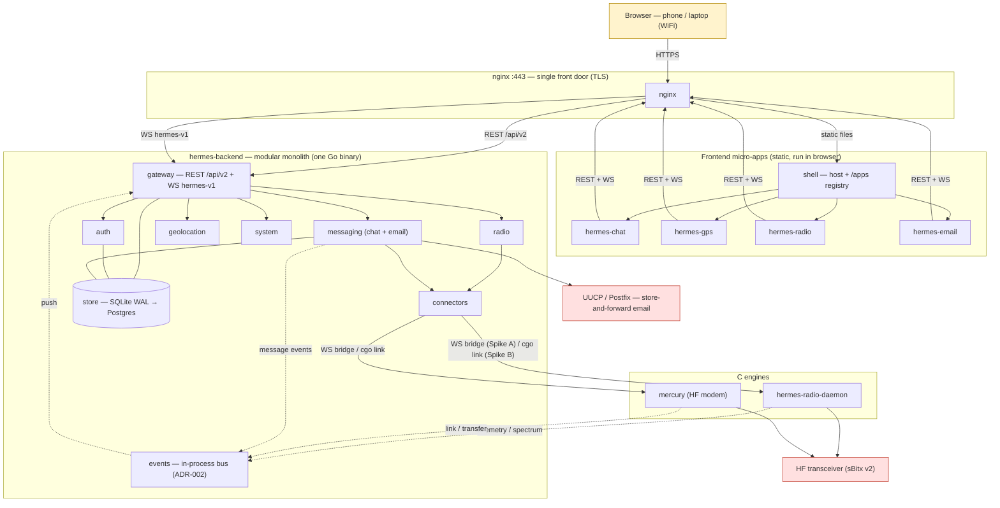

# HERMES Redesign — Complete Architecture

2026-10-09 · draft POC — structure only

The complete target architecture as one diagram. **Solid arrows** are
request/command flows; **dotted arrows** are event pushes (engine → connector →
in-process bus → gateway → WS subscribers). Companion to the contracts in
`contracts/`.

## Legend

- **Solid arrows** = request/command flow; **dotted arrows** = event push
  (via the in-process bus → gateway → WS subscribers).
- **Connectors** are the seam hiding the transport: WebSocket bridge *now*
  (Spike A) vs. cgo link *later* (Spike B, ADR-006).
- **`messaging`** spans chat and email — the same store-and-forward store;
  email's over-the-air path exits via **UUCP/Postfix**.
- **Voice** is not a separate service: it is the radio's audio channel
  (WebRTC signaling gated behind `ENABLE_WEBRTC=false`).
- **Store** is SQLite WAL today, PostgreSQL via `DatabaseAdapter` later
  (ADR-001).

## Rendering

GitHub renders this diagram natively in `.md`. For the GitHub Pages hub, add
`mermaid.js`, or render to SVG with `mermaid-cli` — matching the existing
`architecture.svg` convention in `tech_docs/api-redesign/`.
